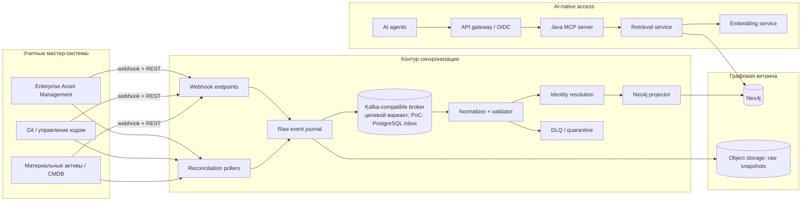
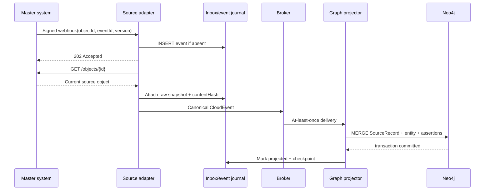
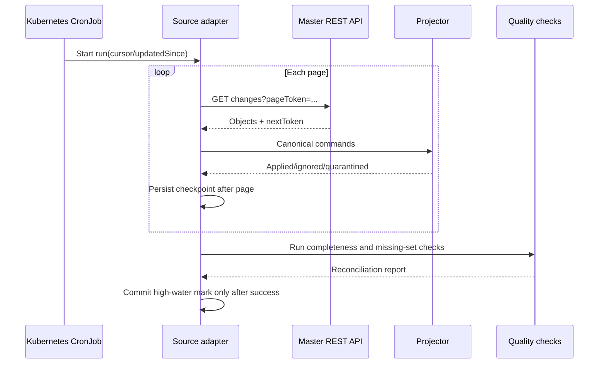
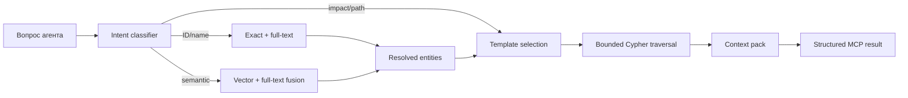
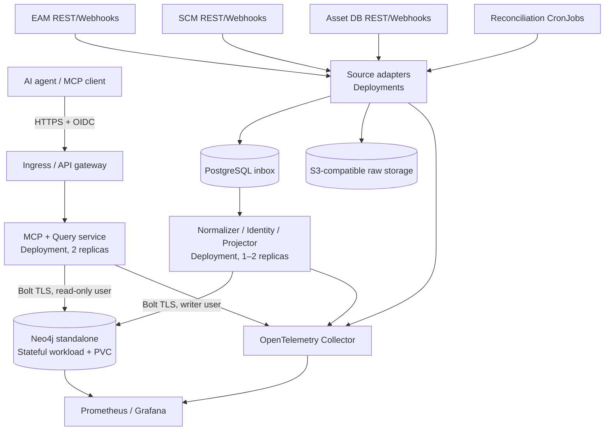

# AI-native витрина архитектурных активов: GraphRAG, Neo4j, Java и MCP

## Решения владельца для PoC (2026-10-03)

Ниже — решения владельца, внесенные в документ по месту. Где раздел ниже описывает целевой/production-вариант, а для PoC выбран иной, это помечено явно.

1. `DEPENDS_ON` — master EAM ([Provenance и авторитетность](#provenance-и-авторитетность)).
2. `Deployment` — master: deploy map + Helm charts, отдельный `deploymap-adapter` ([Provenance и авторитетность](#provenance-и-авторитетность), [Java-модули](#java-модули)).
3. Мастер-системы в PoC — заглушки.
4. В Neo4j Community нет ролей: `mcp-reader` и `graph-projector` — раздельные учетные записи и Secrets, read-only и domain-фильтрацию обеспечивает приложение ([Безопасность](#безопасность), [Критерии готовности PoC](#критерии-готовности-poc)).
5. В `SourceRecord` вместо `key` используется поле `source` ([Идентичность узлов](#идентичность-узлов)).
6. `Namespace` и `KubernetesCluster` моделируются, но в PoC не наполняются ([Основные узлы](#основные-узлы)).
7. Вместо `analyze_impact` — `trace_dependencies(mode=trace|impact)` ([Tools первого релиза](#tools-первого-релиза)).
8. Replay/rebuild/reconcile/crosswalk выполняются через админский эндпоинт ingestion-сервиса, а не через MCP и не через внешний ingress ([Сценарии адаптеров](#сценарии-адаптеров)).
9. Критерий готовности 2: p95 ≤ 30 с на заглушках ([Критерии готовности PoC](#критерии-готовности-poc)).
10. Сборка — Maven multi-module, CI — GitHub Actions ([Java-модули](#java-модули)).

Дополнительно: event backbone для PoC — PostgreSQL inbox (вариант A), Kafka — production ([Варианты исполнения](#варианты-исполнения)); демо-стенд PoC разворачивается на Docker Compose, а не в Kubernetes ([PoC topology](#poc-topology)).

## Резюме решения

Для данного сценария целесообразно строить не «классический GraphRAG из документов», а **операционный knowledge graph архитектуры предприятия**: мастер-системы остаются владельцами данных, Neo4j становится производной read-only витриной, адаптеры поддерживают ее актуальность, а MCP-сервер предоставляет агентам ограниченный набор предметных операций.

Ключевое архитектурное решение — разделить систему на четыре независимых контура:

1. **Синхронизация**: адаптеры REST/webhook, журнал событий, нормализация, разрешение идентичности и идемпотентная проекция в Neo4j.
2. **Графовая витрина**: канонические архитектурные сущности, связи, provenance, актуальность и выборочная история.
3. **Retrieval/GraphRAG**: точный поиск, full-text, vector search и ограниченные обходы графа; LLM не должен самостоятельно определять неограниченный Cypher.
4. **Доступ агентов**: Java/Spring AI MCP-сервер с предметными read-only tools и resources, OAuth/OIDC, аудитом и лимитами.

Это соответствует общей модели GraphRAG, включающей graph-based indexing, graph-guided retrieval и graph-enhanced generation, но использует уже структурированные корпоративные источники вместо извлечения всех сущностей из неструктурированного текста.[^1][^2]

## Целевая архитектура



В production-варианте webhook обеспечивает низкую задержку, а периодический reconciliation закрывает пропущенные события, изменения без webhook и расхождения. Kubernetes `CronJob` предназначен для повторяющихся задач и создает отдельные `Job`, поэтому подходит для reconciliation, backfill и периодической проверки качества.[^3][^4]

### Границы ответственности

| Компонент | Отвечает за | Не отвечает за |
|---|---|---|
| Source adapter | Получение изменений, source cursor, raw envelope | Каноническую модель графа |
| Normalizer | Маппинг source DTO в канонические команды | Доступ агентов |
| Identity resolver | Сопоставление source ID и canonical ID | Генерацию ответов LLM |
| Graph projector | Идемпотентные `MERGE`, связи, provenance | Вызов мастер-систем |
| Retrieval service | Безопасные шаблоны Cypher, hybrid retrieval | Синхронизацию |
| MCP server | Контракт tools/resources, auth context, аудит | Владение бизнес-данными |
| Neo4j | Read model и графовые индексы | Роль system of record |

## Почему это GraphRAG

Microsoft GraphRAG строит граф из текста, формирует иерархические сообщества и их summaries, а затем предлагает global, local, DRIFT и basic search. В рассматриваемой задаче основные сущности и отношения уже существуют в EAM, SCM и CMDB, поэтому дорогое LLM-извлечение графа не должно быть исходной точкой.[^5]

Рекомендуются три режима retrieval:

| Режим | Тип вопроса | Механизм |
|---|---|---|
| Entity/local | «Где развернут сервис billing-api?» | Exact/full-text entity resolution → 1–3 ограниченных перехода |
| Path/impact | «Что пострадает при остановке VM?» | Детерминированный traversal по allowlist связей |
| Semantic | «Какие решения относятся к антифроду?» | Vector/full-text поиск по описаниям и документам → traversal от найденных сущностей |

Neo4j поддерживает full-text и vector indexes; full-text использует Lucene и возвращает результаты по релевантности. Vector search возвращает approximate nearest neighbours и может комбинироваться с full-text для hybrid search. Паттерн `VectorCypherRetriever` сначала выполняет similarity search, затем расширяет найденные узлы Cypher-обходом, что непосредственно соответствует требуемой схеме retrieval; в Java его разумно реализовать собственным небольшим слоем над официальным драйвером.[^6][^7][^8][^9][^10]

**Не рекомендуется** на первом этапе строить community detection и LLM summaries для всего графа. Это оправдано позднее для вопросов уровня «какие архитектурные риски общие для домена», но не для инвентаризации, трассировки зависимостей и impact analysis.

## Каноническая модель

Граф следует проектировать от целевых вопросов — impact analysis, runtime footprint, ownership, сравнение стендов и provenance, — а не как механическую копию таблиц трех источников. Neo4j также рекомендует начинать с запросов, давать узлам уникальные идентификаторы, использовать конкретные типы связей и проверять модель на реальных данных.[^11][^12]

### Слои модели

```text
Governance:   BusinessDomain -- ITSystem -- Solution -- Platform -- Team
Delivery:     ITSystem -- Service -- Repository -- Artifact -- API
Runtime:      Service -- Deployment -- Environment -- Namespace/VM -- PhysicalServer
Data:         Service -- Database/Dataset
Knowledge:    Document -- KnowledgeChunk -- architectural entities
Provenance:   SourceSystem -- SourceRecord -- Assertion -- canonical entities
Operations:   SyncRun -- SourceEvent -- ProjectionResult
```

Не все слои должны появиться в первом инкременте. Для PoC достаточно вертикального среза `ITSystem -> Service -> Deployment -> Environment -> ComputeInstance`, дополненного `Repository`, `Team` и provenance; `API`, `Database`, `Document` и semantic chunks добавляются после проверки базовых traversal-запросов.

### Ключевые различия

| Сущность | Что означает | Критерий идентичности |
|---|---|---|
| `ITSystem` | Управляемый архитектурный актив из EAM | Стабильный EAM business key |
| `Service` | Самостоятельно разрабатываемая/развертываемая часть системы | Service catalog ID; временно repository + module path |
| `Artifact` | Неизменяемый результат сборки | Digest или package coordinates + version |
| `Deployment` | Наблюдаемое развертывание версии сервиса на стенде | Service + environment + deployment key |
| `ComputeInstance` | Вычислительный ресурс | CMDB CI ID; hostname не считать вечным ID |
| `Environment` | Логический стенд | Нормализованный environment code |
| `SourceRecord` | Конкретная запись мастер-системы | Source + object type + source ID |

`Deployment` нужен как промежуточный узел, потому что связывает более двух контекстов — сервис, версию, окружение и runtime target — и имеет собственные свойства и жизненный цикл. Neo4j рекомендует intermediate nodes для n-ary facts и ситуаций, где к связи требуется присоединять дополнительный контекст.[^13][^14]

### Идентичность узлов

На всех канонических узлах используется внутренний `gid: UUID`. На узле не следует хранить один универсальный `externalId`; внешняя идентичность представляется отдельными `SourceRecord`:

```text
(:SourceSystem {code: 'EAM'})
  -[:OWNS_RECORD]->
(:SourceRecord {
  source: 'EAM',
  sourceType: 'IT_SYSTEM',
  sourceId: '1042',
  sourceVersion: '184',
  contentHash: 'sha256:...',
  fetchedAt: datetime(...),
  active: true
})
  -[:ASSERTS {confidence: 1.0, authority: 'MASTER'}]->
(:ITSystem {gid: '...', name: 'Payments'})
```

> **Открытый вопрос:** формат `sourceId` не зафиксирован: здесь `'1042'`, а в каноническом событии ниже — `'EAM-1042'`. Решение владельца не принято; до него оба примера остаются как есть.

Такой паттерн позволяет нескольким системам подтверждать один canonical node, не смешивает источник с бизнес-сущностью и дает точку для tombstone, версии и hash. Узлы должны иметь уникальное свойство или набор свойств; специфические relationship types уменьшают лишние обходы.[^15][^16]

### Основные узлы

| Label | Назначение | Ключевые свойства |
|---|---|---|
| `ITSystem` | Учетная ИТ-система | `gid`, `name`, `status`, `criticality`, `description` |
| `Solution` | Архитектурное решение | `gid`, `name`, `lifecycle`, `description` |
| `Platform` | Технологическая/бизнес-платформа | `gid`, `name`, `type`, `version` |
| `Service` | Деплоимый или логический сервис | `gid`, `name`, `serviceType`, `language`, `status` |
| `Repository` | Репозиторий исходного кода | `gid`, `url`, `defaultBranch`, `archived` |
| `Artifact` | Контейнерный образ/JAR/дистрибутив | `gid`, `coordinates`, `version`, `digest` |
| `Environment` | Контур/стенд | `gid`, `name`, `class` (`DEV/TEST/PREPROD/PROD`) |
| `Deployment` | Экземпляр развертывания сервиса | `gid`, `name`, `version`, `status`, `observedAt` |
| `ComputeInstance` | Общий тип вычислительного ресурса | `gid`, `hostname`, `ip`, `os`, `state` |
| `VirtualMachine` | Виртуальная машина | свойства `ComputeInstance` + `hypervisorRef` |
| `PhysicalServer` | Физический сервер | свойства `ComputeInstance` + `serialNumber` |
| `KubernetesCluster` | Кластер Kubernetes (моделируется, в PoC не наполняется) | `gid`, `name`, `version` |
| `Namespace` | Namespace кластера (моделируется, в PoC не наполняется) | `gid`, `name` |
| `Database` | Логическая/физическая БД | `gid`, `name`, `engine`, `version` |
| `API` | Предоставляемый интерфейс | `gid`, `name`, `protocol`, `specUrl` |
| `Team` | Владелец/эксплуатант | `gid`, `name`, `type` |
| `Document` | Архитектурный документ | `gid`, `title`, `uri`, `textHash` |
| `KnowledgeChunk` | Фрагмент текста для semantic retrieval | `gid`, `text`, `embedding`, `model`, `sourceUri` |
| `SourceRecord` | Происхождение записи | `source`, `sourceType`, `sourceId`, `sourceVersion`, `fetchedAt`, `contentHash` |
| `SyncRun` | Запуск адаптера | `runId`, `adapter`, `startedAt`, `endedAt`, `status`, counters |

`gid` — внутренний стабильный UUID витрины. Внешние идентификаторы не следует делать единственным глобальным ключом: совпадение значений в разных системах не означает тождество сущностей.

### Основные отношения

```text
(ITSystem)-[:DECOMPOSED_INTO]->(Service)
(ITSystem)-[:USES_SOLUTION]->(Solution)
(Solution)-[:USES_PLATFORM]->(Platform)
(Service)-[:IMPLEMENTED_IN]->(Repository)
(Repository)-[:BUILDS]->(Artifact)
(Service)-[:HAS_DEPLOYMENT]->(Deployment)
(Deployment)-[:IN_ENVIRONMENT]->(Environment)
(Deployment)-[:RUNS_ON]->(ComputeInstance|Namespace)   // Namespace — моделируется, в PoC не наполняется
(Namespace)-[:PART_OF]->(KubernetesCluster)             // моделируется, в PoC не наполняется
(VirtualMachine)-[:HOSTED_ON]->(PhysicalServer)
(Service)-[:DEPENDS_ON {kind, protocol, criticality}]->(Service)
(Service)-[:USES_DATABASE]->(Database)
(Service)-[:PROVIDES_API]->(API)
(Service)-[:CONSUMES_API]->(API)
(ITSystem|Service|Platform)-[:OWNED_BY]->(Team)
(Document)-[:DESCRIBES]->(ITSystem|Solution|Service|Platform)
(KnowledgeChunk)-[:PART_OF]->(Document)
(SourceRecord)-[:ASSERTS]->(любая каноническая сущность)
(SyncRun)-[:PROCESSED]->(SourceRecord)
```

Связь `Deployment` должна быть отдельным узлом, а не непосредственной связью `Service -> VM`: у нее есть собственные версия, окружение, статус и время наблюдения. Это также позволяет одному сервису иметь несколько экземпляров в одном окружении.

### Provenance и авторитетность

Для каждого типа атрибута и связи нужна **authority matrix**. Например:

| Данные | Master | Допустимые дополнения |
|---|---|---|
| ИТ-система, критичность, владелец | EAM | Ручная модерация |
| Сервис, репозиторий, язык | SCM/catalog | EAM alias |
| VM, physical host, serial number | CMDB/asset DB | Runtime discovery |
| Deployment на стенде | Deploy map + Helm charts (отдельный `deploymap-adapter`) | SCM metadata |
| Связь `DEPENDS_ON` между сервисами | EAM | SCM metadata |
| Описания и документы | EAM/docs | Репозиторий |

Было: master для `Deployment` — «CD/Kubernetes или CMDB». Мастер-системы в PoC — заглушки; их контракты фиксируются, а реальные интеграции подключаются после PoC.

`SourceRecord` сохраняет источник конкретного утверждения, время извлечения, версию и hash. Такая модель проще для аудита конфликтов, чем массив `sourceIds` на бизнес-узле, и концептуально согласуется с W3C PROV, где `Entity`, `Activity` и `Agent` позволяют описывать происхождение и цепочки преобразований.[^17]

### История

В PoC рекомендуется хранить в Neo4j:

- текущее состояние канонических сущностей;
- `firstSeenAt`, `lastSeenAt`, `deletedAt`, `isCurrent`;
- `validFrom`/`validTo` только на критичных отношениях, например `RUNS_ON`, `DEPENDS_ON`, `OWNED_BY`;
- полные raw snapshots/events — в объектном хранилище.

Neo4j описывает time-based versioning через `validFrom`/`validTo`, позволяющее получать snapshot, difference, temporal traversal и history, но полное версионирование увеличивает дублирование. Поэтому версионировать весь граф на первом этапе нецелесообразно.[^18]

### Constraints и indexes

```cypher
CREATE CONSTRAINT it_system_gid IF NOT EXISTS
FOR (n:ITSystem) REQUIRE n.gid IS UNIQUE;

CREATE CONSTRAINT service_gid IF NOT EXISTS
FOR (n:Service) REQUIRE n.gid IS UNIQUE;

CREATE CONSTRAINT source_record_key IF NOT EXISTS
FOR (n:SourceRecord)
REQUIRE (n.source, n.sourceType, n.sourceId) IS UNIQUE;

CREATE RANGE INDEX deployment_env IF NOT EXISTS
FOR (n:Deployment) ON (n.environmentKey);

CREATE FULLTEXT INDEX asset_text IF NOT EXISTS
FOR (n:ITSystem|Solution|Platform|Service|Document)
ON EACH [n.name, n.description, n.title];

CREATE VECTOR INDEX chunk_embedding IF NOT EXISTS
FOR (n:KnowledgeChunk) ON n.embedding
OPTIONS {indexConfig: {
  `vector.dimensions`: 1024,
  `vector.similarity_function`: 'cosine'
}};
```

> **Открытый вопрос:** индекс `deployment_env` построен по `environmentKey`, которого нет в модели `Deployment` (см. «Основные узлы»: окружение задается связью `IN_ENVIRONMENT`). Нужно решить: добавить свойство в модель или перестроить индекс. Не решено.

Для `source_record_key` в Community Edition используется `IS UNIQUE`: ранее здесь стоял `IS NODE KEY`, который доступен только в Enterprise. `UNIQUE` не требует существования свойств, поэтому обязательность `source`, `sourceType`, `sourceId` проверяет приложение (Community), см. E2.

Уникальные constraints предотвращают дубликаты, а node key требует одновременно существования и уникальности составного ключа; key constraints относятся к Enterprise Edition. Размерность vector index обязана совпадать с размерностью embedding-модели. Конкретные `1024` и модель должны быть зафиксированы ADR и не меняться без контролируемой переиндексации.[^19][^20][^9]

## Identity resolution

Identity resolution — главный риск проекта. Рекомендуется трехступенчатая политика:

1. **Deterministic mapping**: `(source, sourceType, sourceId) -> gid`.
2. **Approved crosswalk**: таблица подтвержденных соответствий между источниками, например `eam.systemCode ↔ scm.catalogSystemId`.
3. **Candidate matching**: hostname, repository URL, normalized name, ownership и другие признаки создают только `IdentityCandidate`, но не автоматический merge при недостаточной уверенности.

LLM или embedding similarity могут предлагать соответствия, но не должны самостоятельно объединять записи. Ошибочный merge опаснее дубликата: он создает ложные dependency paths и неверный blast radius.

Для удаления следует применять tombstone-подход: событие удаления помечает source record неактивным; каноническая сущность удаляется или архивируется только когда отсутствуют активные authoritative assertions. Это предотвращает потерю узла, который подтверждается несколькими системами.

## Синхронизация

Синхронизация должна сочетать быстрый event path и контролирующий reconciliation path. Webhook сообщает, что объект изменился, но адаптер по возможности повторно читает актуальное состояние через REST: это снижает зависимость от полноты webhook payload и унифицирует create/update.

### Сценарии адаптеров

| Сценарий | Триггер | Поведение адаптера | Поведение проектора |
|---|---|---|---|
| Initial bootstrap | Ручной запуск/Job | Постранично читает все объекты, сохраняет cursor и raw snapshot | Идемпотентно создает узлы и связи; не удаляет отсутствующие до завершения полного snapshot |
| Near-real-time upsert | Webhook | Валидирует подпись, фиксирует event, затем делает `GET by id` | Применяет только более новую `sourceVersion`; обновляет `SourceRecord` и authoritative assertions |
| Incremental polling | CronJob | Вызывает `updatedSince/cursor`, обрабатывает страницы | Те же команды, что для webhook; путь записи единый |
| Delete webhook | Событие удаления | Если возможно, подтверждает статус через API | Ставит tombstone на `SourceRecord`; canonical node закрывается только при отсутствии других active assertions |
| Snapshot disappearance | Объект пропал из полного snapshot | После успешного окончания snapshot вычисляет missing set | Помечает отсутствующие записи неактивными; не делает hard delete в середине загрузки |
| Duplicate event | Повторная доставка | Находит inbox по `source + eventId` | Возвращает прежний result без повторной мутации |
| Out-of-order event | Версия/время меньше примененной | Сохраняет raw event с `IGNORED_OLD_VERSION` | Не откатывает состояние |
| Partial object | API возвращает неполную запись | Помечает completeness и ставит retry | Не затирает известные authoritative поля `null`-значениями без явной семантики удаления |
| Broken reference | Сервис ссылается на неизвестную систему | Публикует команду со source reference | Создает `UnresolvedReference` либо quarantine; не создает фиктивный business node без политики |
| Source outage/rate limit | 429/5xx/timeout | Backoff, jitter, Retry-After, circuit breaker | Сохраняет прежнюю витрину; обновляет freshness/lag, не объявляет данные удаленными |
| Contract change | Неизвестная schema version | Сохраняет raw payload, отправляет в quarantine | Не выполняет best-effort запись неизвестной структуры |
| Replay/backfill | Оператор задает диапазон/cursor | Повторно публикует raw events с новым replay ID | Дедупликация по business event ID/version; результат детерминирован |
| Merge identities | Подтверждено, что два узла — один актив | Создает approved crosswalk command | Переносит связи контролируемой миграцией, оставляет redirect/audit record |
| Split identity | Ошибочный merge | Оператор задает mapping source records | Перестраивает проекцию из raw events/snapshots, а не редактирует граф вручную |

Операции replay, rebuild, reconcile и crosswalk в PoC выполняются через **админский эндпоинт ingestion-сервиса**: он не входит в MCP и не публикуется на внешнем ingress. Оформление этих операций как Kubernetes `Job` — позже, после PoC.

### Поток webhook



Webhook endpoint должен быстро вернуть `202` после надежной фиксации входа, а не удерживать соединение до записи в Neo4j. Если мастер поддерживает только callback без последующего `GET`, raw payload становится входом normalizer, но его schema version и полнота должны проверяться явно.

### Поток reconciliation



High-water mark нельзя продвигать до успешной проекции всей подтвержденной страницы. Для полного snapshot удаления применяются только после маркера `snapshot-complete`; иначе падение на середине может ошибочно удалить половину витрины.

### Состояния обработки

```text
RECEIVED -> VALIDATED -> NORMALIZED -> RESOLVED -> PROJECTED
                    \-> QUARANTINED
                                  \-> RETRYING -> ...
PROJECTED -> SUPERSEDED
RECEIVED  -> DUPLICATE | IGNORED_OLD_VERSION
```

Для каждой стадии сохраняются `eventId`, `correlationId`, `syncRunId`, source cursor, schema version, timestamps, error code и payload reference. Сами большие payloads лучше хранить в объектном хранилище, а в операционной БД — метаданные и hash.

### Конфликты источников

Проектор не должен применять правило «последняя запись победила» ко всем данным. Решение определяется authority matrix на уровне поля или типа связи:

- `ITSystem.criticality` обновляет только EAM.
- `Service.repositoryUrl` обновляет SCM/service catalog.
- `ComputeInstance.state` обновляет CMDB/runtime inventory.
- Неавторитетное отличающееся значение создает `Conflict`, но не заменяет canonical value.
- Ручное решение конфликта хранится как отдельное утверждение с автором, причиной и сроком действия.

### Каноническое событие

```json
{
  "specversion": "1.0",
  "id": "01J...",
  "source": "urn:corp:eam",
  "type": "architecture.asset.upserted.v1",
  "subject": "it-system/EAM-1042",
  "time": "2026-09-30T17:20:00Z",
  "dataschema": "urn:corp:schema:asset-upserted:1",
  "correlationid": "...",
  "data": {
    "sourceType": "IT_SYSTEM",
    "sourceId": "EAM-1042",
    "sourceVersion": "184",
    "payload": {}
  }
}
```

CloudEvents задает vendor-neutral envelope; комбинация `source + id` должна быть уникальной и может использоваться consumer для распознавания повторной доставки. Event-контракты полезно вести в AsyncAPI, которая является protocol-agnostic машинно-читаемой спецификацией message-driven API.[^21][^22]

### Гарантии обработки

Не следует проектировать систему в предположении, что сеть и webhooks дадут exactly-once. Нужны:

- at-least-once delivery;
- дедупликация по `source + eventId`;
- монотонная проверка `sourceVersion` или `updatedAt`;
- идемпотентный `MERGE` по constrained keys;
- inbox/checkpoint для каждого consumer;
- retry с exponential backoff;
- DLQ с причиной, payload reference и возможностью replay;
- периодический reconciliation по cursor или `updatedSince`;
- полный backfill как отдельная операция.

Если мастер-система сама публикует события из транзакционной БД, transactional outbox устраняет разрыв между сохраненным состоянием и публикуемым событием; Debezium предоставляет outbox event router для чтения outbox-таблицы.[^23][^24]

### Варианты исполнения

| Вариант | Плюсы | Минусы | Решение |
|---|---|---|---|
| Каждый адаптер напрямую пишет в Neo4j | Минимум компонентов | Сильная связанность, разные правила merge, сложный replay | Только временный PoC |
| REST/webhook → Kafka → normalizer/projector | Replay, backpressure, независимое масштабирование, наблюдаемость | Дополнительная инфраструктура | **Целевой вариант** (PoC: PostgreSQL inbox, Kafka — production) |
| REST/webhook → PostgreSQL inbox → worker | Проще Kafka, транзакционная очередь | Ниже throughput, сложнее fan-out | **PoC: выбран** (вариант A) |
| Kafka Connect Neo4j sink | Меньше кода для простых отображений | Сложная identity resolution и authority rules плохо помещаются в конфиг | Использовать выборочно |

Neo4j Kafka Connector умеет применять сообщения из Kafka в Neo4j, но его CDC sink ориентирован прежде всего на события, произведенные другой Neo4j, а не на произвольные hand-written domain events. Для трех гетерогенных мастер-систем предпочтителен собственный Java projector. Neo4j CDC нужен для распространения изменений **из** графовой витрины в downstream-системы, а не как основной механизм загрузки в нее.[^25][^26]

### Java-модули

Сборка — Maven multi-module, CI — GitHub Actions (каркас репозитория из PR #1).

```text
architecture-knowledge-platform/
├── contracts/
│   ├── canonical-model
│   ├── event-schemas
│   └── source-spi
├── adapters/
│   ├── eam-adapter
│   ├── scm-adapter
│   ├── asset-adapter
│   └── deploymap-adapter      # Deployment: deploy map + Helm charts
├── ingestion/
│   ├── normalizer
│   ├── identity-resolution
│   └── graph-projector
├── access/
│   ├── graph-query-core
│   ├── retrieval-service      # вне PoC
│   └── mcp-server
└── platform/
    ├── helm                   # E5
    ├── observability          # E5
    └── integration-tests
```

Порты адаптера:

```java
public interface SourceConnector {
    SourcePage fetchChanges(SourceCursor cursor, int limit);
    SourceSnapshot fetchById(SourceObjectId id);
}

public interface CanonicalMapper {
    List<GraphCommand> map(SourceEnvelope envelope);
}

public sealed interface GraphCommand
        permits UpsertNode, UpsertRelation, CloseAssertion, TombstoneSourceRecord {}
```

Source DTO не должны проникать в graph projector. Маппинг следует тестировать contract fixtures, а операции проекции — integration tests с реальным Neo4j/Testcontainers.

## MCP-сервер

### Выбор транспорта

Для нового удаленного MCP API следует выбрать **Streamable HTTP**, а не legacy HTTP+SSE и не WebSocket. В спецификации MCP 2026-07-28 стандартными bindings являются `stdio` и Streamable HTTP; при Streamable HTTP каждое JSON-RPC сообщение отправляется отдельным `POST` на единый endpoint, а ответ возвращается как JSON либо как ограниченный данным запросом SSE stream.[^27][^28]

| Вариант | Статус для MCP | Применение | Решение |
|---|---|---|---|
| `stdio` | Стандартный transport | Локальный desktop/CLI agent, sidecar | Поддержать для разработки |
| Legacy HTTP+SSE | Deprecated с MCP 2025-03-26 | Совместимость со старыми клиентами | Не использовать как основной; временный compatibility endpoint при доказанной необходимости[^29] |
| Streamable HTTP | Основной стандартный remote transport | Kubernetes, gateway, OAuth, stateless scale-out | **Выбрать для production** |
| WebSocket | Не является стандартным MCP binding | Собственный realtime-протокол приложения | Не использовать между MCP client и server |

Важно различать **SSE как самостоятельный старый transport** и **SSE как формат потокового ответа внутри Streamable HTTP**. Во втором случае клиент посылает обычный HTTP POST, а сервер может вернуть `text/event-stream` только на время конкретного запроса; это не отдельный постоянный `/sse` канал. В редакции MCP 2026-07-28 удалены прежний GET stream endpoint и protocol-level sessions, что упрощает stateless deployment за ingress/load balancer.[^30][^27]

WebSocket имеет смысл только для собственного UI-чата, push-уведомлений или внутренней шины, если они действительно требуют постоянного full-duplex канала. Такой WebSocket gateway должен оставаться отдельным от MCP и сам выступать MCP client к Streamable HTTP server; иначе получится нестандартный transport, несовместимый с готовыми MCP clients.

### HTTP-контракт

```http
POST /mcp HTTP/1.1
Authorization: Bearer <access-token>
Content-Type: application/json
Accept: application/json, text/event-stream
MCP-Protocol-Version: 2026-07-28

{
  "jsonrpc": "2.0",
  "id": "req-42",
  "method": "tools/call",
  "params": {
    "name": "trace_dependencies",
    "arguments": {
      "gid": "7db...",
      "mode": "impact",
      "environment": "PROD",
      "maxDepth": 3
    }
  }
}
```

Простой вызов возвращает `application/json`; длительная операция может вернуть request-scoped `text/event-stream`. При этом сам `trace_dependencies` в режиме `impact` лучше удерживать в синхронном бюджете 5–15 секунд; тяжелые пересчеты оформлять отдельной job/task-моделью, а не держать поток минутами.

### Совместимость Spring AI

Spring AI предоставляет Java MCP SDK integration, Boot starters, annotations и sync/async API; в Spring AI 2.0 Streamable HTTP является основным transport, а SSE deprecated. Spring starters по-прежнему содержат SSE-настройки для совместимости, но наличие библиотеки не делает legacy SSE правильным выбором для нового API.[^31][^32][^33][^34]

Перед фиксацией версии следует провести interoperability test с выбранными агентами: `initialize`, `tools/list`, `tools/call`, JSON response, streaming response, cancellation, OAuth failure и rolling upgrade. Версии MCP protocol должны согласовываться через `MCP-Protocol-Version`; старых клиентов при необходимости обслуживать отдельным endpoint/Deployment с ограниченным сроком жизни.

Для серверного Kubernetes-развертывания рекомендуется:

- Java 21;
- Spring Boot 4.x, совместимый со Spring AI 2.x;
- `spring-ai-starter-mcp-server-webmvc` или WebFlux;
- `spring.ai.mcp.server.protocol=STREAMABLE`;
- stateless deployment из двух и более реплик;
- OAuth/OIDC на gateway и проверка JWT/scopes в приложении;
- отдельная read-only учетная запись Neo4j (в Community read-only обеспечивается приложением, см. «Безопасность»).

### Tools первого релиза

| Tool | Параметры | Возвращает |
|---|---|---|
| `search_assets` | `query`, `types`, `environment`, `limit` | Кандидаты с `gid`, типом, score и provenance |
| `get_asset` | `gid`, `includeRelations` | Карточка актива и разрешенные связи |
| `trace_dependencies` | `gid`, `mode` (`trace` \| `impact`), `direction`, `depth`, `relationTypes`, `environment` | `trace` — ограниченный subgraph/path; `impact` — зависимые системы/сервисы и объяснимые пути (ранее отдельный tool `analyze_impact`) |
| `find_runtime_footprint` | `systemGid`, `environment` | Deployments, VM, clusters, namespaces |
| `compare_environments` | `systemGid`, `left`, `right` | Различия версий и инфраструктуры |
| `explain_provenance` | `gid`, `property` | Источник, версия, fetchedAt, conflict state |
| `find_stale_assets` | `type`, `olderThan` | Просроченные записи |
| `search_architecture_context` | `question`, filters | Hybrid retrieval context без готового LLM-ответа |
| `get_sync_status` | `source` | Cursor, lag, last success, counters |

### Resources и prompts

```text
architecture://schema/current
architecture://asset/{gid}
architecture://asset/{gid}/provenance
architecture://environment/{name}/topology
architecture://sync/{source}/status
```

- Prompt `impact-analysis`: единый шаблон анализа изменения.
- Prompt `architecture-review`: проверка полноты ownership, runtime и dependencies.
- Prompt `incident-context`: формирование контекста по сервису/хосту/окружению.

MCP различает tools, resources и prompts; resources адресуются URI и могут поддерживать уведомления об изменениях. Tools являются model-controlled, поэтому сервер обязан валидировать вход, применять access control, rate limits и sanitization, а клиенту рекомендуется показывать чувствительные вызовы и вести аудит.[^35][^36][^37]

### Почему не arbitrary Cypher

Официальный Neo4j MCP server уже предоставляет `get-schema` и `read-cypher`, а read-only режим проверяет тип запроса через `EXPLAIN`; документация отдельно предупреждает, что некорректно классифицированные custom procedures могут обойти такую проверку. Он полезен для разработки и работы доверенных архитекторов, но production MCP для широкого круга агентов должен отдавать **предметные инструменты с параметризованными шаблонами**, потому что это дает:[^38][^39]

- предсказуемую стоимость traversal;
- неизменяемую семантику API;
- фильтрацию по пользователю и домену;
- контролируемый объем ответа;
- устойчивость к prompt injection и schema drift;
- стабильную телеметрию по use case.

Отдельный admin/developer endpoint может оставить `read_cypher`, но только с read-only DB role (production / Enterprise; в PoC на Community роли нет, поэтому `read_cypher` не включается), timeout, `EXPLAIN`, allowlist procedures, запретом `LOAD CSV`, APOC write procedures и жестким row/result limit.

## Retrieval pipeline



Context pack должен содержать:

- найденные сущности и связи;
- path explanation, а не только итоговый список;
- provenance для существенных фактов;
- `lastSeenAt` и предупреждение о stale data;
- conflict markers;
- идентификаторы для последующих MCP-вызовов;
- усечение с явным `truncated=true`.

На Neo4j 2026.01+ предпочтительный способ запроса vector indexes — Cypher `SEARCH`; прежние `db.index.vector.queryNodes()`/`queryRelationships()` deprecated с 2026.04. Это следует скрыть за Java-интерфейсом `SemanticRetriever`, чтобы смена синтаксиса или внешней vector DB не меняла MCP-контракт.[^40][^10]

Embeddings следует создавать только для текстовых полей и `KnowledgeChunk`. Neo4j может хранить embeddings и создавать их через GenAI plugin с внешними провайдерами, но для on-prem/private cloud безопаснее вызывать корпоративный embedding endpoint из Java worker, не передавая ключи провайдера в запросах Cypher.[^41][^42]

## Безопасность

HTTP-вариант MCP должен использовать OAuth 2.1/OIDC-профиль: MCP authorization specification требует Protected Resource Metadata и bearer tokens, предназначенные именно для соответствующего MCP resource server. При этом Spring AI starter сам по себе публикует HTTP JSON-RPC endpoint без authentication/authorization, поэтому security boundary необходимо добавлять явно.[^32][^43]

Рекомендуемая модель:

| Уровень | Контроль |
|---|---|
| Gateway | TLS, OIDC, token validation, rate limit, request size |
| MCP | scopes по tools, input schema validation, max depth/limit, audit |
| Query layer | Только параметризованные query templates, timeout, result budget |
| Neo4j | PoC (Community, ролей и RBAC/PBAC нет): раздельные учетные записи и Secrets `graph-projector` (запись) и `mcp-reader`; read-only обеспечивает приложение. Production / Enterprise: roles projector-writer, mcp-reader, operator |
| Query layer (PoC) | Read-only и domain-фильтрация обеспечиваются приложением (query layer), см. E4 |
| Data | Classification, domain/tenant filter, redaction |
| LLM | Полученный текст считается недоверенным data, а не инструкцией |

*Production / Enterprise* (в Community RBAC и PBAC отсутствуют): Neo4j RBAC позволяет `GRANT`/`DENY` на граф и его элементы. Если доступ зависит от свойства узла, доступен property-based access control, но свойство политики нельзя разрешать изменять пользователю; документация также предупреждает о fail-open поведении некоторых `DENY`-условий. Поэтому критичную tenant/domain-фильтрацию желательно дублировать в query mediation layer и проверять негативными тестами.[^44][^45]

Минимальные меры:

- MCP server не получает write credentials;
- write tools отсутствуют, а не только скрыты prompt-инструкцией;
- каждый ответ содержит security-filter metadata без раскрытия скрытых данных;
- descriptions/documents маркируются как untrusted content;
- tool output не может инициировать следующий tool без политики host/agent;
- лимиты: `maxDepth`, `maxNodes`, `maxPaths`, `timeout`, `maxResponseBytes`;
- журналируются principal, tool, normalized arguments, query-template ID, duration, row count и decision;
- секреты и персональные данные не попадают в prompt/logs.

## Kubernetes и Neo4j

Neo4j официально поддерживает standalone и cluster deployment в Kubernetes через Helm charts. Для рабочего production-кластера Neo4j требуется минимум три server instances. Online backup в Kubernetes доступен через `neo4j-admin` Helm chart и должен писать на persistent/on-prem storage.[^46][^47][^48]

### PoC topology

**Решение владельца: демо-стенд PoC разворачивается на Docker Compose, а не в Kubernetes.** Kubernetes/Helm-описание ниже — целевая (production) топология и входит в «Production delta»; для демо-стенда действует следующее соответствие:

| Kubernetes-вариант ниже | Docker Compose (PoC) |
|---|---|
| `CronJob` для reconciliation | Планировщик внутри адаптера |
| `NetworkPolicy` | Раздельные сети compose |
| External Secrets / Vault | Docker secrets |
| Online backup через `neo4j-admin` Helm chart | `neo4j-admin database dump` / `load` |
| Helm release Neo4j, `Deployment`, PVC | Сервисы compose и именованные volumes |

Далее в этом разделе описана целевая Kubernetes-топология; к демо-стенду она применяется через таблицу выше.

Для production-варианта рекомендуется развернуть изолированный namespace `architecture-kg`, а stateful-компоненты при возможности вынести в отдельные namespaces. Neo4j standalone устанавливается официальным Helm chart; конкретные CPU/RAM следует определять нагрузочным тестом, поскольку требования зависят от размера графа и профиля запросов.[^49][^50]



#### Компоненты

| Компонент | Kubernetes workload | Реплики PoC | Хранилище | Назначение |
|---|---|---:|---|---|
| Neo4j | Официальный Helm release, standalone | 1 | RWO PVC на быстром StorageClass | Канонический граф и индексы |
| MCP + Query service | `Deployment` | 2 | Stateless | Streamable HTTP, tools/resources, retrieval |
| Source adapters | `Deployment` для webhook + `CronJob` для polling | 1 на источник | Stateless | REST/webhook ingestion, cursor management |
| Normalizer/Projector | `Deployment` | 1–2 | Stateless | Mapping, identity resolution, транзакции Neo4j |
| PostgreSQL inbox | Managed DB либо operator/StatefulSet | 1 | PVC | Durable inbox, deduplication, checkpoints, DLQ metadata |
| Raw storage | S3-compatible managed/on-prem service | n/a | Object storage | Исходные payloads, snapshots и replay |
| IdP | Существующий Keycloak/корпоративный OIDC | Внешний | Внешнее | Authentication и scopes |
| Observability | OTel Collector + существующие Prometheus/Grafana | 1+ | По платформенному стандарту | Метрики, traces, логи и alerting |

#### Выбор event backbone

Для первого PoC предпочтителен **PostgreSQL inbox + workers**, если нет готового корпоративного Kafka. Это уменьшает инфраструктурный объем и при этом позволяет проверить идемпотентность, replay, checkpoints и DLQ. Граница задается интерфейсами `EventJournal` и `CanonicalEventPublisher`, чтобы позднее заменить PostgreSQL на Kafka без изменения адаптеров и graph projector.

Если Kafka/Strimzi уже является платформенным стандартом, его следует использовать сразу: Strimzi управляет Kafka, topics и users через Kubernetes Custom Resources и поддерживает KRaft-развертывания. Одноузловой Kafka допустим только для проверки интеграции; production-топология требует HA и отдельного расчета ресурсов.[^51][^52]

```text
Вариант A — облегченный PoC:
Adapter -> PostgreSQL inbox/outbox -> worker -> Neo4j

Вариант B — PoC на целевой платформе:
Adapter -> Kafka raw topic -> normalizer -> canonical topic -> projector -> Neo4j
```

Рекомендуемые Kafka topics при выборе варианта B:

```text
architecture.raw.eam.v1
architecture.raw.scm.v1
architecture.raw.cmdb.v1
architecture.canonical.commands.v1
architecture.projection.results.v1
architecture.dlq.v1
```

#### Namespace и сетевые границы

```text
architecture-kg       MCP, adapters, normalizer, projector, CronJobs
architecture-data     Neo4j, PostgreSQL — если не managed
architecture-events   Strimzi/Kafka — только для варианта B
observability         OTel/Prometheus/Grafana либо существующий platform namespace
```

- Внешний ingress публикует только `/mcp` и webhook endpoints; Neo4j Browser/Bolt наружу не выставляются.
- В Neo4j Community нет ролей: `mcp-reader` и `graph-projector` — раздельные учетные записи и отдельные Secrets (Kubernetes Secrets в production, Docker secrets в PoC); read-only для `mcp-reader` обеспечивает приложение (query layer, см. E4). Adapters не получают Neo4j credentials. Модель «только чтение / минимальные write privileges» на уровне БД — production / Enterprise.
- `NetworkPolicy` разрешает MCP → Neo4j, projector → Neo4j, adapters → inbox/broker/object storage и необходимые egress-вызовы к мастер-системам.
- `Secrets` поступают из External Secrets/Vault; пароли не хранятся в Helm values и Git.
- TLS применяется на ingress и для Bolt; webhook endpoints проверяют подпись, timestamp и replay window.

#### Ресурсные ориентиры

Числа ниже — стартовые гипотезы для функционального PoC, а не production sizing:

| Workload | Requests | Limits | Примечание |
|---|---|---|---|
| Neo4j | 2 CPU, 8 GiB RAM | 4 CPU, 12–16 GiB RAM | Page cache и heap задаются после оценки store/индексов |
| MCP/Query, на pod | 250m CPU, 512 MiB | 1 CPU, 1–2 GiB | Два pod для проверки rolling update и балансировки |
| Projector | 500m CPU, 1 GiB | 2 CPU, 2–4 GiB | Batch size ограничить; контролировать Bolt pool |
| Adapter, на источник | 100m CPU, 256 MiB | 500m CPU, 512 MiB | Основное ограничение обычно source API rate limit |
| PostgreSQL | 500m CPU, 1 GiB | 2 CPU, 4 GiB | Для inbox/checkpoints, не для raw payload archive |

Neo4j sizing необходимо уточнить после загрузки репрезентативного объема и выполнения целевых traversal/vector queries; официальная документация также указывает, что требования зависят от workload.[^49]

#### Надежность PoC

- Neo4j: daily online backup в S3-compatible storage, еженедельный restore test. Официальный Kubernetes-процесс backup/restore использует `neo4j-admin` Helm chart.[^46]
- PostgreSQL: backup/PITR по возможностям платформы; inbox нельзя считать восстанавливаемым только из Neo4j.
- Адаптеры: checkpoint после успешно подтвержденной страницы; `concurrencyPolicy: Forbid` для reconciliation одного источника.
- MCP и projector: readiness/liveness/startup probes, graceful shutdown, PodDisruptionBudget для MCP.
- Raw events: retention не меньше времени, необходимого для расследования и полного rebuild графа.
- Neo4j standalone остается единой точкой отказа, что приемлемо для PoC, но должно быть явно зафиксировано как ограничение.

#### Production delta

| Область | PoC | Production target |
|---|---|---|
| Neo4j | 1 standalone | Enterprise cluster минимум из трех servers; Neo4j указывает минимум три instance для рабочего кластера[^53][^48] |
| Event backbone | PostgreSQL inbox или single-node Kafka | Корпоративный Kafka HA/KRaft, partitions, replication, schema governance |
| PostgreSQL | Single/managed basic | HA managed/operator, PITR |
| MCP | 2 replicas | HPA, disruption budgets, multi-zone placement |
| Backup | Daily, ручная проверка restore | Формальные RPO/RTO, регулярные автоматизированные restore drills |
| DR | Не входит | Репликация backup в отдельный failure domain, runbook восстановления |
| Security | OIDC, namespace policies | Fine-grained domain authorization, SIEM, periodic access review |
| Delivery | Helm вручную/CI | GitOps, signed images, policy-as-code, SBOM |

#### Критерии готовности PoC

PoC считается завершенным, если:

1. Загружен репрезентативный вертикальный срез из трех мастер-систем: минимум `ITSystem -> Service -> Deployment -> Environment -> ComputeInstance`.
2. Webhook-изменение появляется в Neo4j в пределах **p95 ≤ 30 с** на заглушках, а reconciliation исправляет искусственно созданный пропуск.
3. Повторное и out-of-order событие не меняет корректное состояние графа.
4. Полный rebuild из raw storage дает эквивалентный канонический граф.
5. MCP выполняет `search_assets`, `get_asset`, `find_runtime_footprint`, `trace_dependencies` и `explain_provenance` через Streamable HTTP.
6. MCP не может выполнить write query: запрет записи обеспечивается приложением и раздельными учетными записями; projector credentials недоступны MCP-сервису.
7. Impact query возвращает не только список активов, но и объяснимые paths с provenance/freshness.
8. Проверены backup и restore Neo4j, а также replay после восстановления.
9. Зафиксированы p95 latency, sync lag, error/DLQ rate, throughput projection и ограничения глубины traversal.
10. Сформирован production gap list с оценкой HA, лицензирования Neo4j Enterprise, Kafka и эксплуатационной поддержки.

---

## References

1. [Graph Retrieval-Augmented Generation: A Survey | GraphRAG](https://graphrag.com/appendices/research/2408.08921/)

2. [A Survey of Graph Retrieval-Augmented Generation for ...](https://arxiv.org/abs/2501.13958) - Large language models (LLMs) have demonstrated remarkable capabilities in a wide range of tasks, yet...

3. [CronJob](https://kubernetes.io/docs/concepts/workloads/controllers/cron-jobs/) - A CronJob starts one-time Jobs on a repeating schedule.

4. [Jobs | Kubernetes](https://kubernetes.io/docs/concepts/workloads/controllers/job/) - Jobs represent one-off tasks that run to completion and then stop.

5. [Welcome - GraphRAG](https://microsoft.github.io/graphrag/)

6. [Index configuration - Operations Manual - Neo4j](https://neo4j.com/docs/operations-manual/current/performance/index-configuration/) - How to configure indexes to enhance performance in search, and to enable full-text search.

7. [Build applications with Neo4j and Java](https://neo4j.com/docs/java-manual/current/) - The Neo4j Java Driver is the official library to interact with a Neo4j instance through a Java appli...

8. [User Guide: RAG — neo4j-graphrag-python documentation](https://neo4j.com/docs/neo4j-graphrag-python/current/user_guide_rag.html) - Vector Cypher Retriever¶. The VectorCypherRetriever fully leverages Neo4j's graph capabilities by co...

9. [GraphRAG for Python](https://neo4j.com/docs/neo4j-graphrag-python/current/) - GraphRAG for Python¶. This package contains the official Neo4j GraphRAG features for Python. The pur...

10. [Vector indexes - Cypher Manual - Neo4j Graph Data Platform](https://neo4j.com/docs/cypher-manual/current/indexes/semantic-indexes/vector-indexes/) - Information about creating, querying, and deleting vector indexes with Cypher.

11. [neo4j_data_model_best_practices.txt](https://neo4j.com/developer/industry-use-cases/_attachments/neo4j_data_model_best_practices.txt)

12. [What is graph data modeling? - Getting Started - Neo4j](https://neo4j.com/docs/getting-started/data-modeling/) - graph-modeling, data-model, schema, create-model, translate-model, model-performance, model-example

13. [Modeling designs - Getting Started](https://neo4j.com/docs/getting-started/data-modeling/modeling-designs/) - Intermediate nodes Intermediary nodes are nodes that contain data that need to be in the graph but d...

14. [Common Graph Structures - Graph Data Modeling for Neo4j](https://neo4j.com/graphacademy/training-gdm-40/04-common-graph-structures/)

15. [Graph Data Modeling Core Principles](https://neo4j.com/graphacademy/training-gdm-40/03-graph-data-modeling-core-principles/) - You need to strike a balance between number of properties that represent complex data vs. multiple n...

16. [Graph Data Modeling Fundamentals](https://graphacademy.neo4j.com/courses/modeling-fundamentals) - Design graph data models for Neo4j using proven best practices. Turn application questions into node...

17. [PROV-O: The PROV Ontology - W3C](https://www.w3.org/TR/prov-o/)

18. [Versioning - Getting Started](https://neo4j.com/docs/getting-started/data-modeling/versioning/) - See what options of graph data model versioning are commonly used in combination with Neo4j.

19. [Create, show, and drop constraints - Cypher Manual - Neo4j](https://neo4j.com/docs/cypher-manual/current/constraints/managing-constraints/) - Information about creating, listing, and dropping Neo4j's constraints.

20. [Constraints - Cypher Manual](https://neo4j.com/docs/cypher-manual/current/schema/constraints/) - Key constraints: ensure that all properties exist and that the combined property values are unique f...

21. [github.com · cloudevents · specspec/cloudevents/spec.md at main · cloudevents/spec · GitHub](https://github.com/cloudevents/spec/blob/main/cloudevents/spec.md) - CloudEvents Specification. Contribute to cloudevents/spec development by creating an account on GitH...

22. [3.1.0 | AsyncAPI Initiative for event-driven APIs](https://asyncapi.com/docs/reference/specification/v3.1.0) - The AsyncAPI Specification is a project used to describe message-driven APIs in a machine-readable f...

23. [Outbox Event Router](https://debezium.io/documentation/reference/3.4/transformations/outbox-event-router.html)

24. [Outbox Event Router](https://debezium.io/documentation/reference/stable/transformations/outbox-event-router.html)

25. [Introduction - Change Data Capture](https://neo4j.com/docs/cdc/current/) - Introduction - Change Data Capture

26. [neo4j.com › docs › kafkaQuickstart: Sink with Change Data Capture - Neo4j Connector ...](https://neo4j.com/docs/kafka/current/sink/quickstart-cdc/) - Quickstart: Sink with Change Data Capture - Neo4j Connector for Kafka

27. [modelcontextprotocol/docs/specification/2026-07-28/basic ...](https://github.com/modelcontextprotocol/modelcontextprotocol/blob/main/docs/specification/2026-07-28/basic/transports/streamable-http.mdx) - Specification and documentation for the Model Context Protocol - modelcontextprotocol/modelcontextpr...

28. [Overview - Model Context Protocol](https://modelcontextprotocol.io/specification/2026-07-28/basic/transports)

29. [Deprecated Features](https://modelcontextprotocol.io/specification/2026-07-28/deprecated)

30. [The 2026-07-28 MCP Specification Release Candidate](https://blog.modelcontextprotocol.io/posts/2026-07-28-release-candidate/) - The release candidate for the next Model Context Protocol (MCP) specification is now available: a st...

31. [MCP](https://docs.spring.io/spring-ai/reference/api/mcp/mcp-overview.html)

32. [docs.spring.io › mcp-server-boot-starter-docsMCP Server Boot Starter :: Spring AI Reference](https://docs.spring.io/spring-ai/reference/api/mcp/mcp-server-boot-starter-docs.html)

33. [Spring AI 2.0.0 GA Available Now](https://spring.io/blog/2026/06/12/spring-ai-2-0-0-GA-available-now/) - Level up your Java code and explore what Spring can do for you.

34. [MCP Client Boot Starter](https://docs.spring.io/spring-ai/reference/api/mcp/mcp-client-boot-starter-docs.html)

35. [Specification](https://modelcontextprotocol.io/specification/2025-06-18)

36. [Tools - Model Context Protocol](https://modelcontextprotocol.io/specification/draft/server/tools)

37. [Resources](https://modelcontextprotocol.io/specification/2025-06-18/server/resources)

38. [Neo4j official MCP Server](https://github.com/neo4j/mcp) - execute read-only Cypher queries that do not modify database data, enforced via EXPLAIN and Neo4j's ...

39. [Tools - Neo4j MCP](https://neo4j.com/docs/mcp/current/tools/) - Tools - Neo4j MCP

40. [Syntax - Cypher Manual - Neo4j](https://neo4j.com/docs/cypher-manual/current/indexes/syntax/) - Syntax for creating, listing, querying and dropping indexes in Neo4j.

41. [Create and store embeddings - Neo4j GenAI Plugin](https://neo4j.com/docs/genai/plugin/current/embeddings/) - For a hands-on guide on how to use the GenAI plugin on a Neo4j database, see Embeddings & Vector Ind...

42. [Introduction - Neo4j GenAI Plugin](https://neo4j.com/docs/genai/plugin/current/) - Neo4j's GenAI plugin provides functions to interact with external AI providers through Cypher (creat...

43. [Authorization](https://modelcontextprotocol.io/specification/2025-11-25/basic/authorization)

44. [Role-based access control - Operations Manual](https://neo4j.com/docs/operations-manual/current/authentication-authorization/manage-privileges/) - Privileges control the access rights to graph elements using a combined allowlist/denylist mechanism...

45. [Property-based access control - Operations Manual](https://neo4j.com/docs/operations-manual/current/authentication-authorization/property-based-access-control/) - Property-based access control grants or denies permission to read or traverse nodes or relationships...

46. [Back up, aggregate, and restore (online) - Operations Manual](https://neo4j.com/docs/operations-manual/current/kubernetes/operations/backup-restore/) - Back up, aggregate, and restore (online) - Operations Manual

47. [Introduction - Operations Manual - Neo4j](https://neo4j.com/docs/operations-manual/current/kubernetes/introduction/) - Introduction to running Neo4j on a Kubernetes cluster using the Neo4j Helm chart.

48. [Install Neo4j cluster servers - Operations Manual](https://neo4j.com/docs/operations-manual/current/kubernetes/quickstart-cluster/install-servers/) - Install cluster primaries.

49. [Prerequisites - Operations Manual - Neo4j](https://neo4j.com/docs/operations-manual/current/kubernetes/quickstart-standalone/prerequisites/) - Prerequisites for deploying a Neo4j standalone instance to a cloud or a local Kubernetes cluster usi...

50. [Install a Neo4j standalone instance - Operations Manual](https://neo4j.com/docs/operations-manual/current/kubernetes/quickstart-standalone/install-neo4j/) - Install a Neo4j standalone instance.

51. [Strimzi - Apache Kafka on Kubernetes](https://strimzi.io/) - Strimzi provides a way to run an Apache Kafka cluster on Kubernetes in various deployment configurat...

52. [strimzi.io · docs · operatorsStrimzi Overview](https://strimzi.io/docs/operators/latest/full/overview)

53. [Deploy a Cluster](https://neo4j.com/docs/operations-manual/current/kubernetes/quickstart-cluster/) - How to deploy a Neo4j cluster to a cloud or a local Kubernetes cluster using Neo4j Helm chart.

