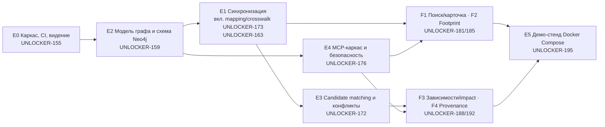

# Порядок разработки PoC

Документ фиксирует, в каком порядке реализуется прототип из [00-vision.md](00-vision.md): последовательность фич, зависимости между ними, правила ветвления и маршрут задач. Задачи ведутся в Multica, в проекте **Arch RAG**. Идентификаторы `UNLOCKER-NNN` ниже — ключи этих задач.

## Принцип

Сначала создаётся инфраструктура, без которой фичам не на чем строиться. Затем идут бизнес-фичи: инструменты MCP из критерия готовности 5. Демо-стенд и замеры делаются в конце, когда система уже работает.

1. **Каркас** нужен, чтобы было куда писать код и чем проверять PR.
2. **Каноническая модель** общая для записи и для чтения, поэтому она идёт раньше обеих сторон.
3. **Запись в граф** (синхронизация) и **чтение из графа** (MCP-каркас) не зависят друг от друга и ведутся параллельно.
4. **Identity resolution** делится на две части. Deterministic mapping и crosswalk (UNLOCKER-173) нужны projector-у сразу, поэтому входят в синхронизацию E1. Candidate matching и конфликты (E3) идут после E1.
5. **Бизнес-фичи** собираются поверх готовых записи и чтения.
6. **Демо-стенд** собирается из готовых сервисов. Замеры и production gap list имеют смысл только на работающей системе.

## Последовательность фич



| Шаг | Фича | Задача | Зависит от | Критерии готовности PoC |
|---|---|---|---|---|
| 1 | E0. Каркас репозитория, CI, актуализация видения | UNLOCKER-155 | — | — |
| 2 | E2. Каноническая модель графа и схема Neo4j (Community) | UNLOCKER-159 | E0 | 1 |
| 3a | E1. Синхронизация из мастер-систем в граф, включая deterministic mapping и crosswalk (UNLOCKER-173) | UNLOCKER-163 | E0, E2 | 1–4 |
| 3b | E4. MCP-сервер: каркас, безопасность, query-слой | UNLOCKER-176 | E0, E2 | 6 |
| 4 | E3. Candidate matching и конфликты источников | UNLOCKER-172 | E2, E1 | — |
| 5 | F1. Поиск и карточка актива (`search_assets`, `get_asset`) | UNLOCKER-181 | E4, E2, E1 | 5 |
| 5 | F2. Runtime footprint (`find_runtime_footprint`) | UNLOCKER-185 | E4, E1 | 5 |
| 5 | F3. Зависимости и impact (`trace_dependencies`, `mode=impact`) | UNLOCKER-188 | E4, E1, E3 | 5, 7 |
| 5 | F4. Provenance (`explain_provenance`) | UNLOCKER-192 | E4, E1, E3 | 5 |
| 6 | E5. Демо-стенд на Docker Compose, backup, замеры, gap list | UNLOCKER-195 | E1, E4 | 8, 9, 10 |

Шаги 3a и 3b идут параллельно. F1 и F2 могут стартовать сразу после E1 и E4, параллельно с E3. F3 и F4 ждут E3 (конфликты нужны для conflict markers). Среди готовых к работе фичи берутся в порядке F1 → F2 → F3 → F4, пока у разработчика есть свободные слоты.

## Подзадачи по стадиям

Внутри фичи подзадачи упорядочены полем `stage`. Подзадачи одной стадии можно вести параллельно, следующая стадия начинается после закрытия предыдущей.

| Фича | Стадия 1 | Стадия 2 | Стадия 3 | Стадия 4 | Стадия 5 |
|---|---|---|---|---|---|
| E0 | UNLOCKER-156 Maven-скелет | UNLOCKER-157 CI; UNLOCKER-158 правка видения | | | |
| E2 | UNLOCKER-160 типы модели и `GraphCommand`; UNLOCKER-161 authority matrix | UNLOCKER-162 схема Neo4j и миграция | | | |
| E1 | UNLOCKER-164 `EventJournal` + raw storage; UNLOCKER-165 `source-spi` и заглушки | UNLOCKER-166 адаптеры; UNLOCKER-167 normalizer; UNLOCKER-173 deterministic mapping и crosswalk | UNLOCKER-168 graph projector | UNLOCKER-169 reconciliation; UNLOCKER-170 админский эндпоинт | UNLOCKER-171 приёмка и замер SLA |
| E3 | UNLOCKER-174 candidate matching | UNLOCKER-175 конфликты | | | |
| E4 | UNLOCKER-177 каркас MCP; UNLOCKER-178 OIDC | UNLOCKER-179 `graph-query-core`; UNLOCKER-180 аудит и телеметрия | | | |
| F1 | UNLOCKER-182 `search_assets`; UNLOCKER-183 `get_asset` | UNLOCKER-184 приёмочный MCP-тест | | | |
| F2 | UNLOCKER-186 `find_runtime_footprint` | UNLOCKER-187 приёмочный MCP-тест | | | |
| F3 | UNLOCKER-189 трассировка; UNLOCKER-190 режим `impact` | UNLOCKER-191 приёмочный MCP-тест | | | |
| F4 | UNLOCKER-193 `explain_provenance` | UNLOCKER-194 приёмочный MCP-тест | | | |
| E5 | UNLOCKER-196 образы и compose; UNLOCKER-197 сети, секреты, TLS | UNLOCKER-198 наблюдаемость; UNLOCKER-199 backup/restore | UNLOCKER-200 замеры и gap list | | |

В E0 дополнительно выполнены UNLOCKER-201 (координаты `akp` → `archrag`) и UNLOCKER-202 (S3 в тестах: MinIO → SeaweedFS).

## Ветвление и вливание

```text
develop
  └─ epic/<PARENT-KEY>          создаётся от develop при старте фичи
       └─ feature/<CHILD-KEY>   одна ветка на подзадачу, от epic
```

- PR подзадачи открывается в `epic/<PARENT-KEY>` как draft, пока не готов к вливанию.
- `feature → epic` вливает архитектор после ревью без блокирующих находок и зелёного CI. После этого подзадача закрывается.
- Когда закрыты все подзадачи фичи, открывается PR `epic/<PARENT-KEY> → develop`. Его вливание выполняется **только по поручению владельца**.
- Сквозные изменения, не относящиеся ни к одной фиче (например, этот документ), идут веткой `feature/<KEY>` от `develop` с PR в `develop`. Вливает владелец.
- Имена веток строятся из ключей задач Multica.

## Маршрут задачи и темп

- Родительские задачи-фичи ведёт Java Squad. Лидер squad — архитектор.
- Подзадача проходит по ролям по очереди:
  1. архитектор детализирует план;
  2. Arch RAG Разработчик пишет код и тесты, затем открывает draft PR;
  3. Arch RAG Ревьюер проверяет диф;
  4. архитектор вливает PR в epic.
- У разработчика одновременно не больше **2** активных задач.
- Архитектор просыпается **каждый час** (автопилот «Arch RAG: почасовая проверка и добор задач из беклога»). Он проверяет PR, SHA и CI, вливает готовые подзадачи в epic и перезапускает зависшие задачи. Если у разработчика есть свободный слот, он берёт следующую подзадачу из беклога в порядке этого документа.

## Решение: deterministic mapping внутри E1 (2026-10-04)

Владелец выбрал вариант B: UNLOCKER-173 (бывш. E3.1, deterministic mapping и approved crosswalk) перенесена из E3 в E1, на стадию 2.

- **Зачем.** Projector (UNLOCKER-168) привязывает `SourceRecord` к узлу и разрешает ссылки между источниками только через сопоставление `(source, sourceType, sourceId) → gid`. Rebuild из raw storage (критерий 4) даёт тот же граф, только если сопоставление хранится, а не генерируется заново. Код в `epic/UNLOCKER-172` недоступен ветке `epic/UNLOCKER-163` до вливания E3 в `develop`, поэтому задача должна жить в той же фиче, что и projector.
- **Зависимости:**
  - UNLOCKER-173 ← E2 и UNLOCKER-164 (PostgreSQL + Flyway);
  - UNLOCKER-168 ← UNLOCKER-173 (собственная таблица сопоставления в projector запрещена);
  - UNLOCKER-170 ← UNLOCKER-173 (загрузка crosswalk).
- **Критерии PoC:**
  - критерии 1–4 закрываются внутри E1 (UNLOCKER-171), без временного сопоставления и повторной приёмки;
  - F1 и F2 не ждут E3;
  - критерии 6 и 8–10 не затронуты.
- **Цена:** стадия 2 фичи E1 выросла на одну подзадачу.
