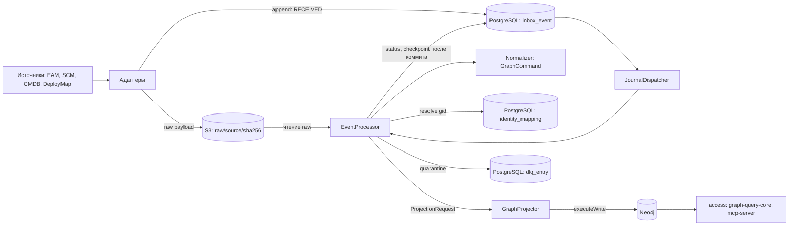
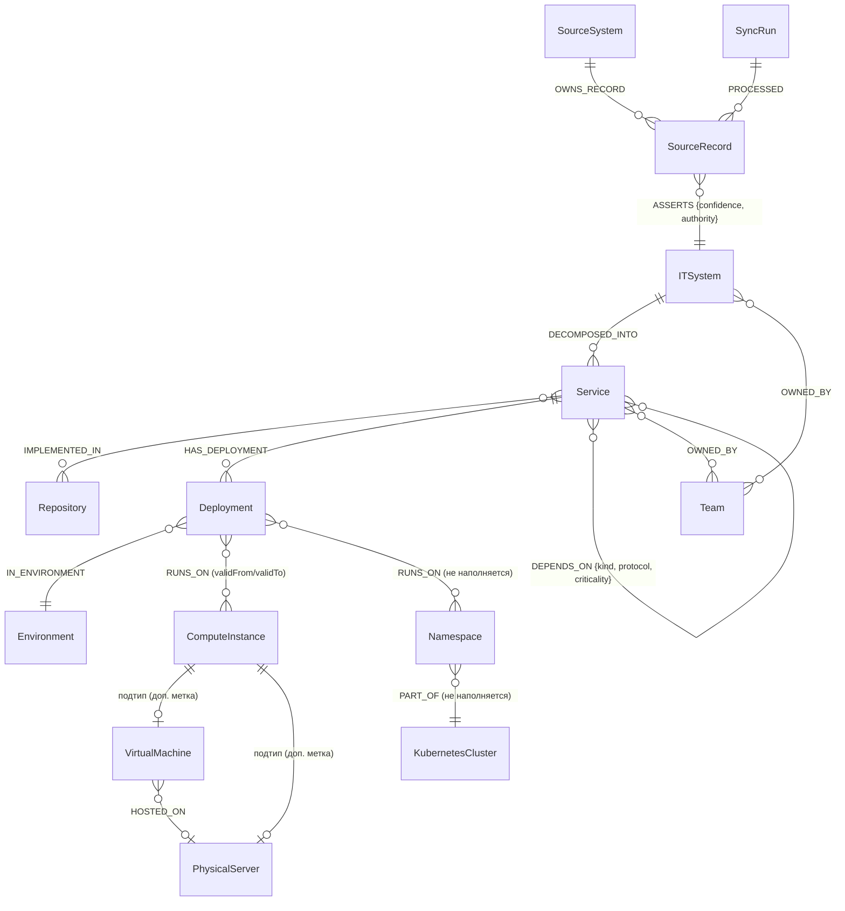
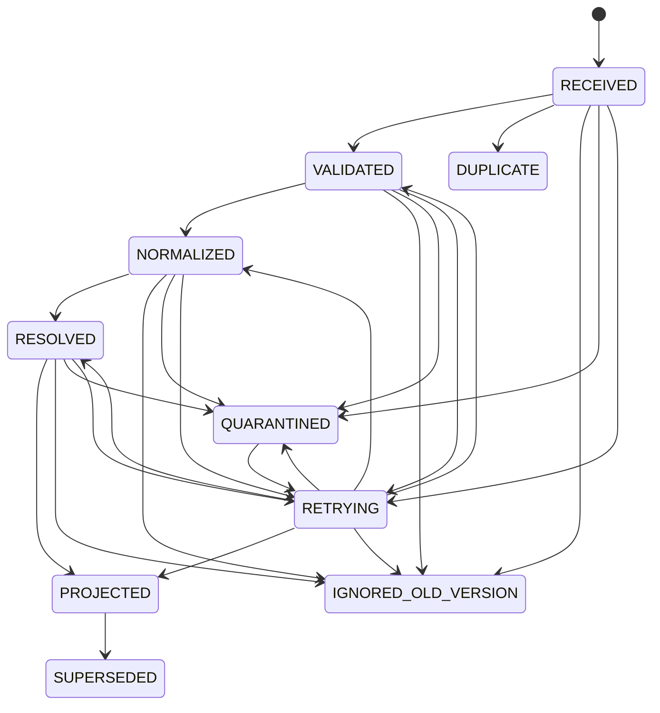

# Модель данных прототипа

> Документ описывает **реализованное** в `develop` на момент UNLOCKER-206, а не запланированное. Расхождения с [видением](00-vision.md) собраны в [разделе 7](#7-расхождения-с-видением). Решения зафиксированы в [ADR](adr/README.md).
>
> Сверка с кодом: пути в колонках «Класс в коде» и «Где в коде» даны от корня репозитория. Команды `grep` для проверки полноты приложены к PR.

## 1. Обзор

Neo4j — производная read model: её можно стереть и пересобрать из журнала и raw payload ([ADR 0001](adr/0001-neo4j-derived-read-model.md)). Источник истины для пересборки — PostgreSQL (журнал, mapping) и S3 (raw).

| Хранилище | Что хранит | Кто пишет | Кто читает | Модуль |
|---|---|---|---|---|
| Neo4j | Канонический граф, provenance (`SourceSystem`, `SourceRecord`, `SyncRun`), отложенные связи (`PendingRelation`) | `GraphProjector`, `Neo4jSchema` | `access/*` (только `executeRead`), `GraphProjector` (чтение версий) | `ingestion/graph-projector`, `access/graph-query-core` |
| PostgreSQL | Inbox/журнал событий, checkpoints, DLQ, mapping и crosswalk, аудит админских операций | `PostgresEventJournal`, `PostgresIdentityMapping`, `AdminAudit` | те же компоненты, `JournalDispatcher`, `ReplayService` | `ingestion/event-journal`, `ingestion/identity-resolution`, `ingestion/ingestion-service` |
| S3 (raw) | Raw payload событий и маркеров snapshot | адаптеры через `InboxWriter`, `Reconciler` (raw tombstone) | `StoredEventReader` (replay, rebuild), `EventProcessor` | `ingestion/event-journal` (`S3RawPayloadStore`) |

Flyway применяет миграции из `classpath:db/migration` одним потоком версий (`JournalMigrations.apply`): `V1` в `event-journal`, `V2` в `identity-resolution`, `V3` в `ingestion-service`. Миграций `V4+` в `develop` нет.

## 2. Граф Neo4j

### 2.1. Узлы

Каждый каноничный узел имеет `gid` (строка UUID) и поля жизненного цикла ([2.3](#23-жизненный-цикл-и-provenance)). Свойства — компоненты record'а `NodeData`; `null` в граф не пишется. Метки задаёт enum `NodeLabel`, класс данных — `NodeData` (sealed). Классы лежат в `contracts/canonical-model/src/main/java/io/github/unlocker/archrag/canonicalmodel/`.

| Метка | Назначение | Ключ | Свойства (тип) | Кто наполняет (источник) | Класс в коде |
|---|---|---|---|---|---|
| `ITSystem` | Учётная ИТ-система | `gid` | `name`\*, `status`, `criticality` (`LOW/MEDIUM/HIGH/CRITICAL`), `description` | EAM (`EamMapper`, `IT_SYSTEM`) | `node/ITSystem` |
| `Team` | Владелец/эксплуатант | `gid` | `name`\*, `type` | EAM (`EamMapper`, `TEAM`) | `node/Team` |
| `Service` | Сервис | `gid` | `name`\*, `serviceType`, `language`, `status` | SCM (`ScmMapper`, `SERVICE`) | `node/Service` |
| `Repository` | Репозиторий | `gid` | `url`\*, `defaultBranch`, `archived` (Boolean; `null` = неизвестно) | SCM (`ScmMapper`, `REPOSITORY`) | `node/Repository` |
| `Environment` | Контур | `gid`; `code` под UNIQUE `environment_code` | `code`\* (= `sourceId`), `name`\*, `environmentClass`\* (`DEV/TEST/PREPROD/PROD`) | DeployMap (`DeployMapMapper`, `ENVIRONMENT`) | `node/Environment` |
| `Deployment` | Развёртывание сервиса | `gid` | `deploymentKey`\* (= `sourceId`), `name`\*, `version`, `status`, `observedAt` (datetime) | DeployMap (`DeployMapMapper`, `DEPLOYMENT`) | `node/Deployment` |
| `ComputeInstance` | Вычислительный ресурс; корневая метка | `gid` | `hostname`\*, `kind`\* (`VIRTUAL_MACHINE/PHYSICAL_SERVER/UNSPECIFIED`), `ip`, `os`, `state`, `hypervisorRef` (только VM), `serialNumber` (только PhysicalServer) | CMDB (`CmdbMapper`, `COMPUTE_INSTANCE`) | `node/ComputeInstance` |
| `VirtualMachine` | Подтип `ComputeInstance` | `gid` | как у `ComputeInstance` | CMDB, `kind=VIRTUAL_MACHINE` | `node/ComputeInstance`, `node/NodeLabel` |
| `PhysicalServer` | Подтип `ComputeInstance` | `gid` | как у `ComputeInstance` | CMDB, `kind=PHYSICAL_SERVER` | `node/ComputeInstance`, `node/NodeLabel` |
| `Namespace` | Namespace кластера | `gid` | `name`\* | **моделируется, в PoC не наполняется** ([ADR 0011](adr/0011-namespace-cluster-modeled-not-populated.md)) | `node/Namespace` |
| `KubernetesCluster` | Кластер | `gid` | `name`\*, `version` | **моделируется, в PoC не наполняется** | `node/KubernetesCluster` |
| `SourceSystem` | Система-источник | `code` (UNIQUE `source_system_code`) | `code` (`EAM/SCM/CMDB/DEPLOYMAP/MANUAL`), `name` | `GraphProjector` (`MERGE` при проекции записи) | `provenance/SourceSystem`, `provenance/SourceSystemCode` |
| `SourceRecord` | Происхождение объекта источника | `(source, sourceType, sourceId)` (UNIQUE `source_record_key`) | `source`, `sourceType`, `sourceId`, `sourceVersion`, `contentHash`, `fetchedAt` (datetime), `active`, `deletedAt` (datetime) | `GraphProjector` | `provenance/SourceRecord`, `provenance/SourceKey` |
| `SyncRun` | Прогон адаптера | `runId` (UNIQUE `sync_run_id`) | `runId`, `adapter`, `status`, `startedAt` (datetime); `endedAt`/счётчики в модели есть, проектор их не пишет | `GraphProjector` (`linkSyncRun`) | `provenance/SyncRun`, `provenance/SyncRunStatus` |
| `PendingRelation` | Служебный: отложенная связь с неизвестным концом (не часть канонической модели) | `key` (UNIQUE `pending_relation_key`) | `key` (SHA-256), свойства связи одной JSON-строкой | `GraphProjector` (`PendingRelations`) | `ingestion/graph-projector/.../PendingRelations.java` |

\* — обязательное поле (проверяет конструктор record'а, не БД). Пустые строки отвергаются.

**Наследование.** `VirtualMachine` и `PhysicalServer` — **дополнительные метки** на узле с корневой меткой `ComputeInstance` (`NodeLabel.supertype()`). Узел `UNSPECIFIED` несёт только `ComputeInstance`. `MERGE` идёт по корневой метке и `gid`; при смене подтипа проектор ставит новую метку и снимает метки других подтипов (`staleSubtypes`), поэтому дубль не возникает.

### 2.2. Связи

Допустимые концы задаёт `RelationType` (проверка учитывает подтипы: `RUNS_ON -> VirtualMachine` проходит через `ComputeInstance`). Авторитетный источник — из `AuthorityMatrix` ([раздел 3](#3-authority-matrix)). Классы: `contracts/canonical-model/src/main/java/io/github/unlocker/archrag/canonicalmodel/relation/`.

| Тип | Откуда → куда | Свойства | Версионируется (validFrom/validTo) | Авторитетный источник |
|---|---|---|---|---|
| `DECOMPOSED_INTO` | `ITSystem` → `Service` | — | нет | SCM |
| `IMPLEMENTED_IN` | `Service` → `Repository` | — | нет | SCM |
| `HAS_DEPLOYMENT` | `Service` → `Deployment` | — | нет | DEPLOYMAP |
| `IN_ENVIRONMENT` | `Deployment` → `Environment` | — | нет | DEPLOYMAP |
| `RUNS_ON` | `Deployment` → `ComputeInstance` \| `Namespace` | — | **да** | DEPLOYMAP |
| `PART_OF` | `Namespace` → `KubernetesCluster` | — | нет | DEPLOYMAP (в PoC не наполняется) |
| `HOSTED_ON` | `VirtualMachine` → `PhysicalServer` | — | нет | CMDB (нормализатор связь не строит: есть только свойство `hypervisorRef`) |
| `DEPENDS_ON` | `Service` → `Service` | `kind`, `protocol`, `criticality` (`EamMapper`) | **да** | EAM |
| `OWNED_BY` | `ITSystem` \| `Service` → `Team` | — | **да** | EAM |
| `ASSERTS` | `SourceRecord` → любой канонический узел | `confidence` (1.0), `authority` (`MASTER`/`SUPPLEMENTARY`) | нет | пишет проектор |
| `OWNS_RECORD` | `SourceSystem` → `SourceRecord` | — | нет | пишет проектор |
| `PROCESSED` | `SyncRun` → `SourceRecord` | — | нет | пишет проектор |
| `DEFERS` | `SourceRecord` → `PendingRelation` | — | нет | служебная, пишет проектор; в `RelationType` нет |

На каждой бизнес-связи проектор хранит утверждающую запись: `assertedBySource`, `assertedByType`, `assertedById`. Временные связи (`temporal=true`) дополнительно несут `validFrom` (datetime) и `validTo` (`null` = открыта).

### 2.3. Жизненный цикл и provenance

Поля узла (`Lifecycle`, инвариант: `firstSeenAt <= lastSeenAt`, `isCurrent == (deletedAt == null)`), все времена — `datetime` UTC:

| Поле | Кто выставляет | Правило |
|---|---|---|
| `firstSeenAt` | `GraphProjector.upsertNode` | минимум из текущего значения и времени события |
| `lastSeenAt` | `GraphProjector.upsertNode` | максимум из текущего значения и времени события |
| `isCurrent` | `upsertNode`, `tombstone` | `true` при создании и при MASTER-утверждении; `false` при закрытии узла |
| `deletedAt` | `tombstone` | ставится через `coalesce` при закрытии; снимается при MASTER-upsert |

**Модель утверждений.** `(SourceSystem)-[:OWNS_RECORD]->(SourceRecord)-[:ASSERTS {confidence, authority}]->(узел)`. `authority = MASTER`, если источник авторитетен для метки узла, иначе `SUPPLEMENTARY`. `sourceVersion` — строка из цифр, сравнивается как число (`SourceVersion`, `VersionDecision`).

**Tombstone** — физического удаления нет ([ADR 0020](adr/0020-tombstone-instead-of-hard-delete.md)): `SourceRecord` получает `active=false` и `deletedAt`; открытые временные связи, утверждённые этой записью, закрываются (`validTo = max(validFrom, deletedAt)`); каноничный узел закрывается (`isCurrent=false`, `deletedAt`) **только если нет другой активной записи с `ASSERTS {authority: 'MASTER'}`**.

### 2.4. Диаграмма

`SourceRecord -[:ASSERTS]->` ведёт к любому каноническому узлу, на диаграмме показан один пример.

### 2.5. Constraints и индексы

Применяет `Neo4jSchema.apply(driver)` (`ingestion/graph-projector/.../schema/Neo4jSchema.java`): каждый statement в своей транзакции, `IF NOT EXISTS`. Отдельных Cypher-скриптов нет. Только Community-возможности.

| Имя | Тип | Метка / свойства | Зачем | Отличие от видения |
|---|---|---|---|---|
| `it_system_gid` | UNIQUE | `ITSystem.gid` | ключ `MERGE` узла | совпадает |
| `service_gid` | UNIQUE | `Service.gid` | то же | совпадает |
| `repository_gid` | UNIQUE | `Repository.gid` | то же | в видении только два примера, остальные генерируются из enum |
| `team_gid` | UNIQUE | `Team.gid` | то же | то же |
| `environment_gid` | UNIQUE | `Environment.gid` | то же | то же |
| `deployment_gid` | UNIQUE | `Deployment.gid` | то же | то же |
| `compute_instance_gid` | UNIQUE | `ComputeInstance.gid` | то же (подтипы `MERGE` по корневой метке) | то же |
| `virtual_machine_gid` | UNIQUE | `VirtualMachine.gid` | страховка для метки подтипа | то же |
| `physical_server_gid` | UNIQUE | `PhysicalServer.gid` | то же | то же |
| `namespace_gid` | UNIQUE | `Namespace.gid` | то же | то же |
| `kubernetes_cluster_gid` | UNIQUE | `KubernetesCluster.gid` | то же | то же |
| `source_record_key` | UNIQUE (составной) | `SourceRecord(source, sourceType, sourceId)` | ключ `MERGE` записи источника | **`IS UNIQUE` вместо `IS NODE KEY`** (Community, [ADR 0004](adr/0004-neo4j-community-constraints.md)); обязательность свойств проверяет приложение |
| `source_system_code` | UNIQUE | `SourceSystem.code` | ключ `MERGE` | нет в примерах видения |
| `sync_run_id` | UNIQUE | `SyncRun.runId` | ключ `MERGE` | нет в примерах видения |
| `pending_relation_key` | UNIQUE | `PendingRelation.key` | ключ `MERGE` отложенной связи | нет в видении (служебный узел) |
| `environment_code` | UNIQUE | `Environment.code` | единственность кода окружения | совпадает с видением от 2026-10-04 |
| `asset_text` | FULLTEXT | `ITSystem\|Service` по `name`, `description` | текстовый поиск | **уже, чем в видении**: нет `Solution`, `Platform`, `Document` и свойства `title` (узлов нет в PoC) |

Не создаются: индекс `deployment_env` (убран решением владельца 2026-10-04, в `Neo4jSchema` его нет), `chunk_embedding` (вне PoC), NODE KEY и existence constraints (Enterprise). Состав сверяется с `SHOW CONSTRAINTS` / `SHOW INDEXES` тестом `platform/integration-tests/.../Neo4jSchemaIT.java`; имя `<label>_gid` строится из имени метки (`gidConstraintName`). Ограничение: `IF NOT EXISTS` молча пропускает constraint с тем же именем, но другим определением; при смене определения имя нужно менять.

## 3. Authority matrix

Источник: `contracts/canonical-model/src/main/java/io/github/unlocker/archrag/canonicalmodel/authority/AuthorityMatrix.java` (`AuthorityMatrix.defaults()`). Правила: поиск точный, **неизвестный источник не авторитетен** (fail closed); свойство без своего правила наследует правило метки; подтипы не наследуют правила корня; `MANUAL` авторитетным не бывает.

Узлы и свойства:

| Объект | Авторитетный источник | Явные правила свойств | Где в коде |
|---|---|---|---|
| `ITSystem` | EAM | `criticality` → EAM | `AuthorityMatrix.poc()` |
| `Team` | EAM | — | то же |
| `Service` | SCM | `language` → SCM | то же |
| `Repository` | SCM | `url` → SCM | то же |
| `ComputeInstance`, `VirtualMachine`, `PhysicalServer` | CMDB | `state` → CMDB (у каждой из трёх меток) | то же |
| `Deployment`, `Environment`, `Namespace`, `KubernetesCluster` | DEPLOYMAP | — | то же |
| `SourceSystem`, `SourceRecord`, `SyncRun` | вне матрицы (пустое множество; пишет проектор) | — | `nodeAuthorities` |

Связи:

| Тип | Авторитетный источник |
|---|---|
| `DEPENDS_ON`, `OWNED_BY` | EAM |
| `DECOMPOSED_INTO`, `IMPLEMENTED_IN` | SCM |
| `HAS_DEPLOYMENT`, `IN_ENVIRONMENT`, `RUNS_ON`, `PART_OF` | DEPLOYMAP |
| `HOSTED_ON` | CMDB |
| `ASSERTS`, `OWNS_RECORD`, `PROCESSED` | вне матрицы |

«Допустимые дополнения» из видения в коде не выражены: неавторитетный источник свойства не записывает. **Что происходит с неавторитетным значением:** проектор пропускает его (`GraphProjector.upsertNode` для свойства, `upsertRelation` для связи), не меняя канонического, и возвращает в `ProjectionResult` списки пропущенных (`Label.property`, имя типа связи). Узел при этом утверждается как `SUPPLEMENTARY`. Сущности `Conflict` пока нет (см. [5.5](#55-identitycandidate-и-conflict)).

## 4. Команды проекции (`GraphCommand`)

Sealed-интерфейс `GraphCommand` (`contracts/canonical-model/.../command/`): пять вариантов. Нормализатор выдаёт команды по `SourceKey`; `gid` выдаёт только `IdentityMapping` до транзакции Neo4j. Проектор получает `ProjectionRequest` (ключ записи, `SourceVersion`, время события, `syncRunId`, карта `gid`, команды) и применяет его **одной транзакцией `executeWrite`** без побочных эффектов вне Neo4j.

Общая семантика (`GraphProjector.write`):

1. `MERGE (r:SourceRecord {source, sourceType, sourceId})` с блокирующей записью свойства: версия читается под блокировкой.
2. `VersionDecision`: версия ниже применённой — `IGNORED_OLD_VERSION` (граф не меняется); равная — `NOOP_SAME_VERSION` (в журнале `DUPLICATE`); выше или запись новая — применяется. Исключение: tombstone с равной версией применяется к ещё активной записи.
3. Отложенные связи записи заменяются целиком (старые `PendingRelation` удаляются).
4. Команды применяются по порядку.

| Команда | Поля | Что делает в графе | Идемпотентность | Ошибки |
|---|---|---|---|---|
| `UpsertNode` | `SourceRecord record`, `NodeData data` | `MERGE` узла по `gid` и корневой метке; `SET n += props` только для свойств, по которым источник авторитетен; `null` не пишется; обновляет `SourceRecord` (`sourceVersion`, `contentHash`, `fetchedAt`, `active=true`, снимает `deletedAt`); `ASSERTS {confidence=1.0, authority}`; `firstSeenAt`/`lastSeenAt`; достраивает отложенные связи с этим концом | повтор с той же версией ничего не пишет (`SAME`) | неавторитетные свойства возвращаются в `skippedProperties` |
| `UpsertRelation` | `type`, `from`/`to` (`SourceKey`) и их метки, `properties`, `validity`, `assertedBy` | если источник не авторитетен для типа — пропуск (`skippedRelations`); иначе `MERGE` связи между узлами, найденными по `gid`; `SET rel += props`, `assertedBy*`; для временных: открытая связь сохраняет `validFrom`, новая или закрытая открывается заново, `validTo = validity.validTo` | `MERGE` по паре узлов и типу; повтор не создаёт дубль | конец связи не найден — `ProjectionException(UNRESOLVED_ENDPOINT)` → `RETRYING`; конструктор отвергает недопустимые метки и `validity` у нетемпоральных |
| `CloseAssertion` | `type` (только temporal), `from`, `to`, `validTo`, `assertedBy` | закрывает открытую связь, утверждённую этой записью: `validTo = max(validFrom, validTo)` | нет подходящей открытой связи — ничего не меняется | неавторитетный источник — тихий пропуск (без записи в `skippedRelations`) |
| `TombstoneSourceRecord` | `SourceKey key`, `deletedAt` | `active=false`, `deletedAt`; закрывает открытые временные связи записи; закрывает узел, если нет других активных MASTER-утверждений. Только после `snapshot-complete` или события `asset.deleted` | повтор с равной версией по уже неактивной записи — `SAME` | запрос с tombstone не должен содержать других команд (`ProjectionRequest`) |
| `DeferRelation` | `UpsertRelation relation` | сохраняет `(:PendingRelation)` с ключом SHA-256; когда проецируется второй конец, связь строится как `UpsertRelation` и узел удаляется | ключ детерминирован, повтор перезаписывает | gid для неизвестного конца не нужен |

`ProjectionRequest` держит инварианты: не более одного `UpsertNode`/`TombstoneSourceRecord`; все связи утверждает та же запись; для узла и концов связей (кроме `DeferRelation`) есть `gid`; версия `SourceRecord` равна версии запроса. Нарушение — `IllegalArgumentException`, событие уходит в `QUARANTINED` (`INVALID_COMMANDS`).

## 5. PostgreSQL ingestion-сервиса

Доступ — JDBC без ORM, одна операция = одна транзакция. Время — `timestamptz` (UTC). Миграции: `ingestion/event-journal/src/main/resources/db/migration/V1__event_journal.sql`, `ingestion/identity-resolution/src/main/resources/db/migration/V2__identity_mapping.sql`, `ingestion/ingestion-service/src/main/resources/db/migration/V3__admin_audit.sql`.

### 5.1. Inbox / журнал событий

Таблица `inbox_event` (V1), ключ — `UNIQUE (source, event_id)` (`uq_inbox_event`):

| Колонка | Тип | Null | Назначение |
|---|---|---|---|
| `source` | text | нет | источник события (URN `urn:corp:<код>`) |
| `event_id` | text | нет | идентификатор события (дедупликация) |
| `type` | text | нет | тип CloudEvent (`architecture.asset.upserted.v1`, `architecture.asset.deleted.v1`, `architecture.sync.snapshot-complete.v1`) |
| `subject` | text | да | subject события |
| `source_type`, `source_id` | text | нет | ключ объекта источника |
| `source_version` | text | нет | версия объекта (цифры) |
| `correlation_id` | text | да | корреляция |
| `sync_run_id` | text | да | прогон адаптера |
| `schema_version` | text | нет | схема данных события (`dataschema`) |
| `status` | text | нет | `ProcessingStatus` |
| `attempts` | integer | нет, 0 | счётчик попыток |
| `error_code`, `error_reason` | text | да | код и причина (причина усекается до 500 символов, значения источника не пишутся) |
| `payload_key`, `payload_hash` | text | да | ссылка на raw в S3 и SHA-256 содержимого |
| `received_at`, `updated_at` | timestamptz | нет | время получения и последнего изменения |

Индексы: `ix_inbox_event_status (status, received_at)`, `ix_inbox_event_object (source, source_type, source_id)`. Повторный `append` с тем же `(source, event_id)` не создаёт строку (`INSERT ... ON CONFLICT DO NOTHING`) и возвращает существующую запись со статусом `DUPLICATE`.

### 5.2. Статусы обработки

Значения — enum `ProcessingStatus` (`contracts/event-schemas/.../ProcessingStatus.java`), переходы проверяет `canTransitionTo` под блокировкой строки (`SELECT ... FOR UPDATE`). Переход в себя допустим всегда. Конечные: `PROJECTED` (только в `SUPERSEDED`), `SUPERSEDED`, `DUPLICATE`, `IGNORED_OLD_VERSION`; из `QUARANTINED` выход только через `RETRYING` (решение оператора).

Коды ошибок, которые ставит `EventProcessor`: `UNSUPPORTED_EVENT_TYPE`, `UNKNOWN_SOURCE`, `INVALID_COMMANDS`, `UNRESOLVED_ENDPOINT`, `GRAPH_UNAVAILABLE`, `GRAPH_REJECTED`, `GRAPH_CLIENT_ERROR`, `GRAPH_ERROR`, а также коды `NormalizationException`. `RETRYING` — временные сбои (граф недоступен, конец связи ещё не пришёл), `QUARANTINED` — отказ по самому событию.

### 5.3. Checkpoints и cursor

Таблица `consumer_checkpoint` (V1), `PRIMARY KEY (consumer, source)`:

| Колонка | Тип | Назначение |
|---|---|---|
| `consumer` | text | потребитель (`projector`, константа `EventProcessor.CONSUMER`) |
| `source` | text | источник |
| `cursor` | text | непрозрачный курсор; проектор пишет `eventId` последнего завершённого события |
| `updated_at` | timestamptz | время сдвига |

`EventProcessor.finish` сохраняет checkpoint **только после коммита транзакции Neo4j и перехода события в конечный статус**; при `RETRYING` и `QUARANTINED` курсор не двигается. Сохранение — upsert (`ON CONFLICT (consumer, source) DO UPDATE`). Порядок чтения журнала — keyset `(received_at, source, event_id)` (`JournalKey`).

**Маркер `snapshot-complete`.** Событие типа `architecture.sync.snapshot-complete.v1` пишется адаптером в тот же `inbox_event` (`eventId` событий прогона вида `snap:<syncRunId>:<type>/<id>/v<version>`), raw маркера — `{syncRunId, objectCount, updatedAt}`. Проектор не проецирует его, а передаёт в `Reconciler`: после него активные записи источника, которых нет в журнале прогона (missing set), получают tombstone. Если в журнале меньше событий прогона, чем заявил `objectCount`, ничего не удаляется (маркер уходит в `RETRYING`). Tombstone reconciliation журналируется событием `architecture.asset.deleted.v1` с `eventId = reconcile:<syncRunId>:<sourceType>/<sourceId>`, чтобы replay и rebuild воспроизводили удаление.

### 5.4. Mapping и crosswalk

Таблицы V2 (`PostgresIdentityMapping`):

`identity_mapping`: `PRIMARY KEY (source, source_type, source_id)`; колонки `gid uuid NOT NULL`, `created_at timestamptz NOT NULL`; индекс `ix_identity_mapping_gid (gid)`.

`approved_crosswalk`: `PRIMARY KEY (left_source, left_type, left_id, right_source, right_type, right_id)`; колонки `approved_by`, `reason`, `approved_at` (все NOT NULL). Пара хранится в нормализованном порядке (`left < right`, порядок задаёт приложение, CHECK нет: он зависел бы от коллации).

Семантика ([ADR 0003](adr/0003-gid-and-source-record-identity.md), [ADR 0019](adr/0019-identity-resolution-no-auto-merge.md)):

- `resolve(SourceKey)` создаёт `gid` один раз (`UUID.randomUUID()` + `INSERT ... ON CONFLICT DO NOTHING` + чтение, гонка сходится к одному значению); `find` ничего не создаёт.
- `approve(Crosswalk)` даёт обоим ключам общий `gid`; повтор идемпотентен; если ключи уже отображены на **разные** `gid` — `CrosswalkConflictException`, а не молчаливый выбор.
- `gid` **не выводится из ключа**, а хранится в PostgreSQL; rebuild графа не трогает `identity_mapping`, поэтому после пересборки `gid` прежние.
- Чужой конец связи `gid` не создаёт: если mapping нет, `UNRESOLVED_ENDPOINT` или `DeferRelation`.

### 5.5. IdentityCandidate и Conflict

**Не реализовано** (E3, UNLOCKER-174, UNLOCKER-175). Таблиц `identity_candidate` и `conflict` нет, миграций для них нет. Сейчас: неавторитетное значение пропускается проектором и возвращается в `ProjectionResult` ([раздел 3](#3-authority-matrix)); конфликт двух разных `gid` при approved crosswalk — исключение `CrosswalkConflictException`. Candidate matching не реализован.

### 5.6. DLQ / quarantine

Таблица `dlq_entry` (V1): `id bigserial PRIMARY KEY`, `source`, `event_id` (внешний ключ на `inbox_event (source, event_id)`), `reason text NOT NULL`, `error_code text NOT NULL`, `payload_key` (ссылка на raw), `created_at timestamptz NOT NULL`, `replayed_at timestamptz`. Частичный уникальный индекс `uq_dlq_entry_open (source, event_id) WHERE replayed_at IS NULL`: у события не больше одной необработанной записи, повторный `toDlq` дубль не создаёт.

`EventJournal.toDlq` в одной транзакции переводит событие в `QUARANTINED` с кодом и причиной и пишет `dlq_entry` (причина усекается). Replay — админская операция `ReplayService` (под `AdminLock`), требует scope `architecture.admin`.

Аудит админских операций (V3): таблица `admin_audit` — `id bigserial`, `operation`, `actor`, `request jsonb`, `replay_id`, `status`, `result jsonb`, `error`, `started_at`, `finished_at`; индексы `ix_admin_audit_started`, `ix_admin_audit_replay`. Запись `STARTED` делается до операции.

Роль консоли (V6): `archrag_console_ro` (LOGIN, без пароля, создаётся идемпотентно; пароль задаёт стенд). Права: `USAGE` на схему `public` и `SELECT` на `inbox_event`, `consumer_checkpoint`, `dlq_entry`, `identity_candidate`, `source_conflict`, `admin_audit`; остальные таблицы (`identity_mapping`, `approved_crosswalk`, `identity_feature`, `property_assertion`) недоступны. Для `CREATE ROLE` пользователю миграции нужно `CREATEROLE`.

## 6. Raw storage (S3)

`S3RawPayloadStore` (`ingestion/event-journal`): S3-совместимое хранилище, path-style, регион-заглушка `us-east-1`; бакет задаётся `ARCHRAG_S3_BUCKET` и создаётся при старте (`ensureBucket`). Целостность держит SHA-256, а не доп. checksum SDK. Во всех тестах и на стенде — SeaweedFS ([ADR 0007](adr/0007-s3-raw-storage-seaweedfs.md)).

| Bucket / префикс | Что лежит | Ключ объекта | Кто пишет | Кто читает |
|---|---|---|---|---|
| бакет из `ARCHRAG_S3_BUCKET`, префикс `raw/` | raw payload события источника (JSON изменения) | `raw/<source>/<sha256 hex>` | адаптеры (`InboxWriter.write`) | `StoredEventReader` (replay, rebuild), `EventProcessor` |
| тот же | raw маркера snapshot `{syncRunId, objectCount, updatedAt}` | `raw/<source>/<sha256 hex>` | адаптеры (`InboxWriter`, маркер) | `StoredEventReader` |
| тот же | raw tombstone reconciliation | `raw/<source>/<sha256 hex>` | `Reconciler` | `StoredEventReader` |

- **`contentHash`** — SHA-256 содержимого в hex, без префикса `sha256:`. Он же часть ключа: запись идемпотентна (существующий объект не перезаписывается), чтение сверяет hash (`IllegalStateException` при расхождении).
- **Связь с inbox:** `inbox_event.payload_key` = ключ объекта, `inbox_event.payload_hash` = `contentHash`; в графе тот же hash попадает в `SourceRecord.contentHash` (`Normalizer` передаёт `raw.contentHash()`). Одинаковое содержимое двух событий даёт один объект.
- `source` попадает в ключ, поэтому проверяется по `[A-Za-z0-9:._-]{1,200}` (не только точки).
- **Rebuild** (`RebuildService`): стирает проекцию в Neo4j (constraints и индексы остаются), затем `ReplayService` переигрывает журнал, читая raw из S3; `identity_mapping`, crosswalk и checkpoints адаптеров не трогаются.
- Отдельного формата snapshot-объектов и retention-политики в коде нет: «snapshot» — это набор событий журнала с `syncRunId` и маркер.

## 7. Расхождения с видением

| Тема | В видении | В коде | Причина / ADR |
|---|---|---|---|
| Ключ `SourceRecord` | `IS NODE KEY` | `IS UNIQUE` на `(source, sourceType, sourceId)`; обязательность полей проверяет приложение | Community, [ADR 0004](adr/0004-neo4j-community-constraints.md) |
| Индекс `deployment_env` | в ранней версии по `environmentKey` | не создаётся; окружение — связь `IN_ENVIRONMENT`, `Environment.code` под UNIQUE `environment_code` | решение владельца 2026-10-04; ADR [0025](adr/0025-open-deployment-env-index.md) числится «Предложено», хотя вопрос закрыт: нужна правка ADR (вне этой задачи) |
| `gid`-constraints | примеры для `ITSystem`, `Service` | `<label>_gid` на каждую каноническую метку, генерируются из `NodeLabel` | чтобы новая метка не осталась без constraint (инвариант `Neo4jSchema`); `gid` как ключ — [ADR 0003](adr/0003-gid-and-source-record-identity.md) |
| Служебные constraints | нет | `source_system_code`, `sync_run_id`, `pending_relation_key` | `MERGE` только по ключу под constraint |
| Fulltext `asset_text` | `ITSystem\|Solution\|Platform\|Service\|Document` по `name`, `description`, `title` | `ITSystem\|Service` по `name`, `description` | остальных узлов нет в срезе PoC (`NodeLabel`) |
| Узлы и связи вне PoC | `Solution`, `Platform`, `Artifact`, `Database`, `API`, `Document`, `KnowledgeChunk`; `USES_SOLUTION`, `USES_PLATFORM`, `BUILDS`, `USES_DATABASE`, `PROVIDES_API`, `CONSUMES_API`, `DESCRIBES`, `PART_OF` у чанков | отсутствуют (нет в `NodeLabel`/`RelationType`) | срез PoC, E1 |
| `Namespace`, `KubernetesCluster`, `PART_OF` | моделируются | типы есть, никто не наполняет | [ADR 0011](adr/0011-namespace-cluster-modeled-not-populated.md) |
| `HOSTED_ON` | VM → PhysicalServer | тип есть, нормализатор связь не строит (только свойство `hypervisorRef`) | пробел E1, в PoC данные не требуют |
| Свойство `Environment.class` | `class` | `environmentClass` | `class` — служебное слово Java |
| Тип `Deployment` | `gid, name, version, status, observedAt` | дополнительно `deploymentKey` (= `sourceId`) | ключ идентичности для `deploymap` |
| Дополнительные поля `ComputeInstance` | `ComputeInstance` без вида | `kind` (`VIRTUAL_MACHINE/PHYSICAL_SERVER/UNSPECIFIED`) определяет подтип | подтип по данным CMDB; `UNSPECIFIED` для заглушек |
| `contentHash` | `'sha256:...'` | hex без префикса | совпадает с ключом S3 |
| `ASSERTS.authority` | `'MASTER'` | `MASTER` или `SUPPLEMENTARY` | различие нужно для закрытия узла при tombstone |
| `Service.repositoryUrl` в правилах конфликтов | свойство сервиса | свойства нет; ссылка — связь `IMPLEMENTED_IN` | URL лежит в `Repository.url` |
| «Допустимые дополнения» authority matrix | вторая колонка таблицы | не выражены: неавторитетный источник не пишет свойство | проектор пропускает значение и возвращает его в результате |
| `SyncRun` | `endedAt`, счётчики | проектор пишет `runId`, `adapter`, `status`, `startedAt`; остальное — в модели, но не в графе | инкремент внутри повторяемой транзакции удваивался бы при повторе |
| Статусы обработки | `RECEIVED -> ... -> PROJECTED`, `DUPLICATE`/`IGNORED_OLD_VERSION` из `RECEIVED` | то же, плюс `IGNORED_OLD_VERSION` из любого шага до `PROJECTED` и `RETRYING` → любой шаг | версия сравнивается с графом, а не только с журналом; см. [ADR 0006](adr/0006-postgres-inbox-event-backbone.md) |
| Поля inbox | `source cursor` в каждой стадии | курсор — в отдельной `consumer_checkpoint`; в `inbox_event` нет колонки cursor | checkpoint на `(consumer, source)` |
| Conflict, IdentityCandidate | сущности и ручные решения | **не реализованы** | E3, UNLOCKER-174/175 |
| Объекты raw | «raw snapshots/events» в объектном хранилище | один формат: raw события/маркера по ключу `raw/<source>/<sha256>` | отдельного snapshot-формата нет |
| Жизненный цикл `SyncRun.status` | — | при создании `RUNNING`; перевод в `SUCCEEDED`/`FAILED` в проекторе не реализован | пробел |
