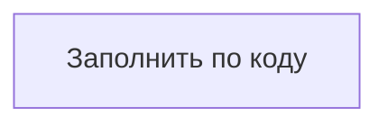
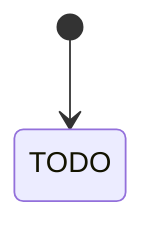

# Модель данных прототипа

> **Статус: шаблон.** Разделы заполняются в UNLOCKER-206 по коду, влитому в `develop`. Документ описывает реализованное, а не запланированное. Расхождения с [видением](00-vision.md) собираются в последнем разделе.
>
> Пометка `TODO(UNLOCKER-206)` означает: что заполнить и откуда брать. Перед вливанием пометки удаляются.
>
> К PR заполнения прикладывается сверка через `grep` по коду и миграциям: каждая метка, связь, таблица и constraint из кода есть в документе, и наоборот.

## 1. Обзор

<!-- TODO(UNLOCKER-206): где какие данные живут. Neo4j — канонический граф (read model). PostgreSQL ingestion-сервиса — inbox, checkpoints, DLQ, mapping/crosswalk, кандидаты, конфликты. S3-совместимое хранилище (SeaweedFS) — raw payloads и snapshots. Добавить схему потоков данных между хранилищами (mermaid flowchart). -->

| Хранилище | Что хранит | Кто пишет | Кто читает | Модуль |
|---|---|---|---|---|
| Neo4j | | | | |
| PostgreSQL | | | | |
| S3 (raw) | | | | |

## 2. Граф Neo4j

### 2.1. Узлы

<!-- TODO(UNLOCKER-206): источник — contracts/canonical-model (типы узлов). Одна строка на метку. Для VirtualMachine/PhysicalServer указать, как реализовано наследование от ComputeInstance (дополнительная метка или отдельный тип). Namespace и KubernetesCluster отметить как «моделируется, в PoC не наполняется». -->

| Метка | Назначение | Ключ | Свойства (тип) | Кто наполняет (источник) | Класс в коде |
|---|---|---|---|---|---|
| | | | | | |

### 2.2. Связи

<!-- TODO(UNLOCKER-206): источник — contracts/canonical-model (типы связей). Указать направление, допустимые метки на концах, свойства на связи (validFrom/validTo, ASSERTS {confidence, authority}, DEPENDS_ON {kind, protocol, criticality}) и авторитетный источник. -->

| Тип | Откуда → куда | Свойства | Версионируется (validFrom/validTo) | Авторитетный источник |
|---|---|---|---|---|
| | | | | |

### 2.3. Жизненный цикл и provenance

<!-- TODO(UNLOCKER-206): поля firstSeenAt, lastSeenAt, deletedAt, isCurrent — кто и когда их выставляет. Модель SourceSystem → SourceRecord -[:ASSERTS]-> узел; tombstone SourceRecord; правило закрытия канонического узла при отсутствии активных authoritative assertions. Источник — ingestion/graph-projector. -->

### 2.4. Диаграмма

<!-- TODO(UNLOCKER-206): mermaid (erDiagram или flowchart) для среза PoC: ITSystem → Service → Deployment → Environment → ComputeInstance, а также Repository, Team, SourceRecord. -->

### 2.5. Constraints и индексы

<!-- TODO(UNLOCKER-206): источник — миграция схемы из UNLOCKER-162 (Cypher-скрипты и код, который их применяет). Таблица должна совпадать с SHOW CONSTRAINTS / SHOW INDEXES на поднятой базе. Отдельно указать отличия от 00-vision.md: Community, составной UNIQUE вместо NODE KEY, судьба индекса deployment_env. -->

| Имя | Тип (UNIQUE / RANGE / FULLTEXT) | Метка / свойства | Зачем | Отличие от видения |
|---|---|---|---|---|
| | | | | |

## 3. Authority matrix

<!-- TODO(UNLOCKER-206): источник — реализация authority matrix (UNLOCKER-161). Перенести таблицу из кода: тип узла / свойство / связь → авторитетный источник. Описать, что происходит с неавторитетным значением (Conflict, см. раздел 5.5). -->

| Объект (узел.свойство / связь) | Авторитетный источник | Допустимые дополнения | Где в коде |
|---|---|---|---|
| | | | |

## 4. Команды проекции (`GraphCommand`)

<!-- TODO(UNLOCKER-206): источник — sealed GraphCommand в contracts/canonical-model и его применение в ingestion/graph-projector. Для каждой команды указать: поля, семантику применения (MERGE по ключу; проверка sourceVersion → IGNORED_OLD_VERSION; поведение при null из неполной записи), идемпотентность. -->

| Команда | Поля | Что делает в графе | Идемпотентность | Ошибки |
|---|---|---|---|---|
| `UpsertNode` | | | | |
| `UpsertRelation` | | | | |
| `CloseAssertion` | | | | |
| `TombstoneSourceRecord` | | | | |

## 5. PostgreSQL ingestion-сервиса

<!-- TODO(UNLOCKER-206): источник — миграции Flyway (UNLOCKER-164, UNLOCKER-173, E3). Для каждой таблицы указать колонки, ключи, уникальные индексы и номер миграции. -->

### 5.1. Inbox / журнал событий

<!-- TODO(UNLOCKER-206): уникальность (source, eventId), колонки статуса, correlationId, syncRunId, schema version, ссылка на payload в S3, contentHash, timestamps, error code. -->

### 5.2. Статусы обработки

<!-- TODO(UNLOCKER-206): фактические значения статусов в коде и разрешённые переходы. Сверить с 00-vision.md, раздел «Состояния обработки». -->

### 5.3. Checkpoints и cursor

<!-- TODO(UNLOCKER-206): что хранится на источник; когда сдвигается high-water mark (только после коммита в Neo4j); маркер snapshot-complete. -->

### 5.4. Mapping и crosswalk

<!-- TODO(UNLOCKER-206): источник — UNLOCKER-173. Таблица (source, sourceType, sourceId) → gid; approved crosswalk; как это гарантирует одинаковые gid после rebuild. -->

### 5.5. IdentityCandidate и Conflict

<!-- TODO(UNLOCKER-206): источник — E3 (UNLOCKER-174, UNLOCKER-175). Если к моменту заполнения код ещё не влит, пометить раздел «не реализовано». -->

### 5.6. DLQ / quarantine

<!-- TODO(UNLOCKER-206): причина, payload reference, механизм replay. -->

## 6. Raw storage (S3)

<!-- TODO(UNLOCKER-206): bucket(ы), схема ключей объектов, формат (raw event / snapshot), contentHash, связь с записью inbox, retention. Как rebuild читает отсюда. В тестах и на стенде — SeaweedFS. -->

| Bucket / префикс | Что лежит | Ключ объекта | Кто пишет | Кто читает |
|---|---|---|---|---|
| | | | | |

## 7. Расхождения с видением

<!-- TODO(UNLOCKER-206): всё, что в коде сделано иначе, чем описано в 00-vision.md. Для каждого пункта указать причину и ссылку на ADR из docs/adr/ или на задачу. -->

| Тема | В видении | В коде | Причина / ADR |
|---|---|---|---|
| | | | |
