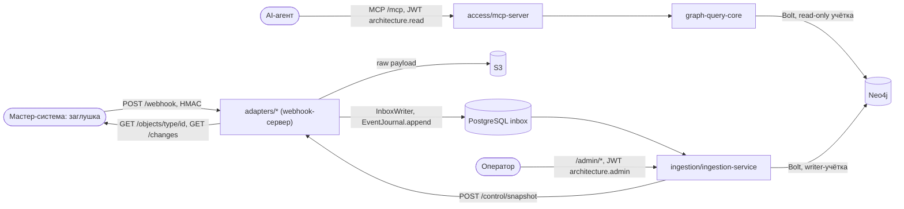
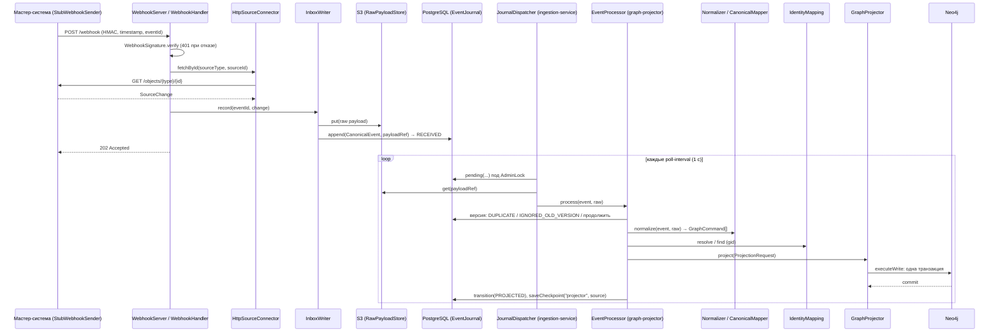
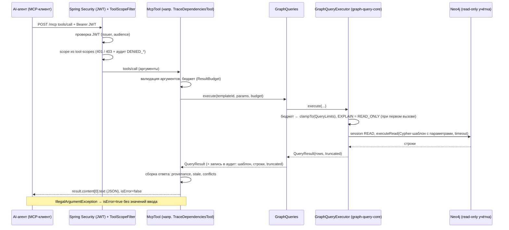

# Интерфейсы взаимодействия прототипа

Документ описывает интерфейсы по фактическому коду в `develop` (после E1, E4, F1–F4). Всё, чего в коде нет (топология compose из E5, tools вне PoC), отмечено явно; порты и пути compose, публикация через reverse proxy и `/control/upsert` заглушки описываются после вливания E5 (строки «— (E5, не в `develop`)» в разделе 6). Расхождения с [видением](00-vision.md) собраны в [разделе 8](#8-расхождения-с-видением). Идентификаторы в примерах (gid, время) взяты из реального прогона и меняются от запуска к запуску.

## 1. Карта интерфейсов



| Интерфейс | Тип | Кто вызывает | Кто обслуживает | Доступность | Аутентификация |
|---|---|---|---|---|---|
| MCP `/mcp` | Streamable HTTP (stateless), JSON-RPC | AI-агент | `access/mcp-server` (порт Spring по умолчанию 8080, `server.port` в `application.yml` не задан) | внешний; публикация через proxy — E5, не в `develop` | JWT (issuer + audience), scope `architecture.read` на `tools/call` |
| `GET /.well-known/oauth-protected-resource` | HTTP | MCP-клиент | `access/mcp-server` | внешний | нет (публичный) |
| `GET /actuator/health/**` | HTTP | оркестратор | `access/mcp-server` | внутренний | нет (публичный) |
| Webhook адаптеров `POST /webhook` | HTTP | мастер-система (заглушка) | `adapters/*` через `WebhookServer` | внешний; порт задаёт код, который запускает адаптер | HMAC-SHA256 + timestamp, JWT нет |
| `POST /control/snapshot` | HTTP | ingestion-сервис (`/admin/reconcile`) | `adapters/*` через `WebhookServer`, тот же порт, что `/webhook` | только внутренняя сеть | **нет** |
| Admin REST `/admin/*` | HTTP | оператор | `ingestion/ingestion-service`, порт `ARCHRAG_ADMIN_PORT` (по умолчанию 8081) | только внутренняя сеть | JWT, scope `architecture.admin` |
| Источники `GET /changes`, `GET /objects/{type}/{id}` | HTTP | адаптеры | заглушки `platform/source-stubs` | внутренний | нет |

Что публикуется через reverse proxy демо-стенда, определит E5 (compose и proxy в `develop` нет): см. [раздел 6](#6-безопасность-на-границах).

## 2. MCP-сервер

Модуль `access/mcp-server`, шаблоны запросов в `access/graph-query-core`. Сервер только читает: единственный путь к графу — `GraphQueries` → `GraphQueryExecutor` с `executeRead` и сессией `AccessMode.READ`; перед первым исполнением шаблона `EXPLAIN` обязан дать `READ_ONLY` (ADR [0005](adr/0005-readonly-mcp-by-application.md), [0018](adr/0018-domain-tools-not-arbitrary-cypher.md)).

### 2.1. Транспорт и протокол

Источник: `access/mcp-server/src/main/resources/application.yml`.

- Endpoint: `POST /mcp` (`spring.ai.mcp.server.streamable-http.mcp-endpoint`). Starter `spring-ai-starter-mcp-server-webmvc`.
- Режим: `spring.ai.mcp.server.protocol=STATELESS`. Сессий нет: `tools/call` и `tools/list` принимаются без предварительного `initialize`, `Mcp-Session-Id` не выдаётся. Это Streamable HTTP без серверного состояния (см. [раздел 8](#8-расхождения-с-видением), п. 1).
- Имя и версия сервера: `arch-rag`, `0.1.0`.
- Заголовки запроса: `Authorization: Bearer <JWT>`, `Content-Type: application/json`, `Accept: application/json, text/event-stream`.
- Формат ответа: во всех проверенных вызовах (`tools/list`, все `tools/call`, включая tool-ошибки) сервер вернул `200 application/json`, без `text/event-stream`. Потоковый ответ tools не использует.
- `GET /mcp` возвращает `405` (проверено на запущенном сервере).
- Тело `POST /mcp` читается фильтром `ToolScopeFilter` не более `archrag.mcp.security.max-request-bytes` (1 МБ): больше — `413`; невалидный JSON, не объект или неподдерживаемая кодировка — `400`.
- Версия протокола (`MCP-Protocol-Version`) в коде сервера не фиксируется и не проверяется: её согласует MCP SDK из Spring AI. Клиент Spring AI (`HttpClientStreamableHttpTransport`) работает с сервером в F1–F4 acceptance-тестах.
- Метрики и аудит: каждый `tools/call` пишет запись в логгер `archrag.audit.mcp` и наблюдение `archrag.mcp.tool.call` (теги `tool`, `decision`: `ALLOWED`, `DENIED_SCOPE`, `DENIED_UNKNOWN_TOOL`, `TIMEOUT`, `ERROR`). Токены и аргументы в теги не попадают (`ToolCallAuditor`).

### 2.2. Аутентификация и scopes

Источник: `McpSecurityConfiguration`, `McpSecurityProperties`, `ToolScopeFilter`; проверено в `McpSecurityTest` и F1–F4 acceptance.

- Сервер — OAuth2 resource server: JWT проверяется на каждый запрос (подпись, `issuer-uri` = `ARCHRAG_OIDC_ISSUER_URI`, `audience` = `archrag.mcp.security.resource-uri` = `ARCHRAG_MCP_RESOURCE_URI`).
- Без проверки токена доступны только `/actuator/health/**` и `/.well-known/oauth-protected-resource/**`.
- Protected Resource Metadata (RFC 9728), реальный ответ:

```json
{"resource":"https://mcp.test/mcp","bearer_methods_supported":["header"],
 "tls_client_certificate_bound_access_tokens":true,
 "authorization_servers":["https://mcp.test/mcp"],
 "scopes_supported":["architecture.read"],"resource_name":"arch-rag"}
```

- Scope проверяется только на `tools/call` (`ToolScopeFilter`, после `AuthorizationFilter`). Остальные методы MCP (`tools/list`, `initialize`) требуют только валидный токен.
- Tool без записи в `archrag.mcp.security.tool-scopes` отклоняется (fail-closed) с `403` и аудитом `DENIED_UNKNOWN_TOOL`.
- Поведение при отказе:
  - без токена или с невалидным: `401`, `WWW-Authenticate: Bearer resource_metadata="<url>/.well-known/oauth-protected-resource"`;
  - токен без нужного scope: `403`, `WWW-Authenticate: Bearer error="insufficient_scope", scope="architecture.read", resource_metadata="<url>/.well-known/oauth-protected-resource"`.

| Tool | Scope |
|---|---|
| `ping` | `architecture.read` |
| `search_assets` | `architecture.read` |
| `get_asset` | `architecture.read` |
| `find_runtime_footprint` | `architecture.read` |
| `trace_dependencies` (режимы `trace` и `impact`) | `architecture.read` |
| `explain_provenance` | `architecture.read` |

### 2.3. Общие правила ответа

Лимиты задаются в `application.yml` (`archrag.query.limits.*`), биндятся в `GraphReaderProperties.Limits`, превращаются в `QueryLimits` (потолки). Запрошенный бюджет режется до потолков методом `ResultBudget.clampTo`.

| Лимит | Значение | Где задаётся |
|---|---|---|
| `max-depth` | 6 | `archrag.query.limits.max-depth`; потолок глубины обхода; глубина подставляется в шаблон числом из проверенного диапазона |
| `max-nodes` | 500 | `archrag.query.limits.max-nodes`; потолок числа строк для шаблонов-узлов |
| `max-paths` | 50 | `archrag.query.limits.max-paths`; потолок числа путей для шаблонов-путей |
| `timeout` | 5 с | `archrag.query.limits.timeout`; таймаут транзакции Neo4j, истёкший даёт `QueryTimeoutException` и `decision=TIMEOUT` |
| `max-response-bytes` | 512 КБ | `archrag.query.limits.max-response-bytes`; строка, превысившая порог, отбрасывается |
| `stale-after` | `P7D` (в ответах `PT168H`) | `archrag.query.stale-after`; `StalenessProperties` |
| `max-request-bytes` | 1 МБ | `archrag.mcp.security.max-request-bytes` |
| `search_assets.limit` | по умолчанию 10, максимум 50 | константы `SearchAssetsTool` (`DEFAULT_LIMIT`, `MAX_LIMIT`), дополнительно режется `max-nodes` |
| `search_assets.query` | до 200 символов | `SearchAssetsTool.MAX_QUERY_LENGTH` |

Общая семантика ответа (текст ответа tool — JSON-строка в `result.content[0].text`):

- `truncated=true`: результат обрезан бюджетом строк, путей или байт (`BudgetedCollector`). При обрезке состав путей `trace_dependencies` может меняться между вызовами.
- Provenance: у узла — `lastSeenAt` и активные записи источников (`source`, `sourceType`, `sourceId`, `authority`); у связи — кто её утверждает (`assertedBy*` или `EdgeProvenance`) и время получения записи (`sourceFetchedAt`). Время везде ISO-8601 UTC.
- Freshness: `stale=true`, если `lastSeenAt` (для связи — `sourceFetchedAt`) не задан или старше `stale-after`; `find_runtime_footprint` и `trace_dependencies` отдают порог в поле `staleAfter` и, у footprint, список `warnings`.
- Conflict markers: узел в `trace_dependencies` несёт `conflicts` — записи источников, чьи значения расходятся с мастером, и имена спорных свойств; `explain_provenance` даёт `conflictState` (`OPEN`/`NONE`) и `conflictProperties`. Значения свойств в маркерах не отдаются.
- Только действующие факты: закрытые узлы и связи (`isCurrent=false`, `validTo` задан) отфильтрованы, кроме `get_asset` и `explain_provenance`, которые возвращают закрытый актив с `isCurrent=false`.
- Ошибка tool: результат `isError=true`, текст — короткая причина без значений из запроса и без stacktrace (`result.content[0].text`), HTTP `200`. Примеры сообщений: `gid must be a UUID`, `asset not found`, `limit must be in 1..50`, `Unknown relation type; allowed: ...`. Сообщение из теста `get_asset` с невалидным gid приходит как `"gid must be a UUID\ngid must be a UUID"` (дубль строки; см. [раздел 8](#8-расхождения-с-видением)).
- Отказ по доступу — не tool-ошибка, а HTTP `401`/`403` (раздел 2.2).

### 2.4. Tools

Состав совпадает с выводом `tools/list` запущенного сервера (6 tools: `explain_provenance`, `find_runtime_footprint`, `get_asset`, `ping`, `search_assets`, `trace_dependencies`). Полный вывод `tools/list` приложен комментарием к PR. В `annotations` каждого tool сервер отдаёт `readOnlyHint=true`, `destructiveHint=false`, `idempotentHint=true`, `openWorldHint=false` (тест `McpSecurityTest.toolsListMarksAllToolsReadOnly`); сами подсказки защитой не служат, read-only обеспечивает приложение (`executeRead`).

Запрос в примерах — тело `POST /mcp` с `Authorization: Bearer <JWT со scope architecture.read>`; ответ показан по `result.content[0].text`, с сокращениями (`…`).

#### `ping`

Служебный tool для проверки доступности и interop-проверки каркаса. Класс `PingTool`.

- **Назначение:** вернуть `{"status":"ok"}`.
- **Scope:** `architecture.read`.
- **ID шаблона запроса:** нет (к графу не обращается).
- **Параметры:** нет.
- **Ответ:** строка `{"status":"ok"}`.

```text
>>> {"jsonrpc":"2.0","id":2,"method":"tools/call","params":{"name":"ping","arguments":{}}}
<<< {"jsonrpc":"2.0","id":2,"result":{"content":[{"type":"text","text":"{\"status\":\"ok\"}"}],"isError":false}}
```

#### `search_assets`

Класс `SearchAssetsTool`. Точное совпадение по `gid`/`sourceId`, затем полнотекстовый поиск по имени и описанию. Полнотекстовый поиск идёт только по `ITSystem` и `Service`, остальные типы находятся точным совпадением. Возвращает только актуальные активы.

- **Scope:** `architecture.read`.
- **ID шаблона запроса:** `search_assets`.
- **Параметры:**

| Параметр | Тип | Обязателен | Ограничения | Описание |
|---|---|---|---|---|
| `query` | string | да | не пустой, до 200 символов | `gid`, `sourceId` или текст для поиска |
| `types` | string[] | нет | из `ITSystem`, `Service`, `Repository`, `Team`, `Environment`, `Deployment`, `ComputeInstance` | фильтр по меткам; неизвестная метка — ошибка |
| `environment` | string | нет | — | фильтр по `Environment.code` |
| `limit` | integer | нет | 1..50, по умолчанию 10 | максимум результатов |

- **Ответ:** `{items: [{gid, type, name, score, matchType, sources[], lastSeenAt}], truncated}`. `matchType` — `EXACT` (score фиксированно 1000, идут первыми) или `FULLTEXT`; `sources` — системы-источники активных записей; `truncated=true`, если кандидатов больше `limit` или сработал бюджет.
- **Пример вызова и ответа:**

```text
>>> {"jsonrpc":"2.0","id":3,"method":"tools/call","params":{"name":"search_assets","arguments":{"query":"Payments","types":["ITSystem"],"limit":5}}}
<<< {"items":[{"gid":"e833c322-80f7-4938-9cde-7f0671d09b22","type":"ITSystem","name":"Payments Core","score":0.2976705729961395,"matchType":"FULLTEXT","sources":["EAM"],"lastSeenAt":"2026-10-06T09:10:24.075410506Z"}],"truncated":false}
```

#### `get_asset`

Класс `GetAssetTool`. Карточка актива по `gid`: свойства, времена наблюдения, записи источников и действующие связи 1 уровня (в обе стороны; `gid` соседей можно передавать в следующие вызовы).

- **Scope:** `architecture.read`.
- **ID шаблона запроса:** `get_asset` (карточка), `asset_relations` (связи).
- **Параметры:**

| Параметр | Тип | Обязателен | Ограничения | Описание |
|---|---|---|---|---|
| `gid` | string | да | UUID | `gid` актива |
| `includeRelations` | boolean | нет | по умолчанию `true` | включить связи 1 уровня |

- **Ответ:** `{gid, type, properties{…}, firstSeenAt, lastSeenAt, deletedAt, isCurrent, sources[{source, sourceType, sourceId, sourceVersion, fetchedAt, active, authority}], relations[{relationType, direction (OUT|IN), gid, type, name, isCurrent, validFrom}], truncated}`. Служебные ключи (`gid`, `isCurrent`, `firstSeenAt`, `lastSeenAt`, `deletedAt`) в `properties` не дублируются. Закрытый актив возвращается с `isCurrent=false`; неактивные записи источников показывают, почему узел закрыт. Типы связей: `DECOMPOSED_INTO`, `IMPLEMENTED_IN`, `HAS_DEPLOYMENT`, `IN_ENVIRONMENT`, `RUNS_ON`, `DEPENDS_ON`, `OWNED_BY`. Ошибки: `gid must be a UUID`, `asset not found`.
- **Пример вызова и ответа:**

```text
>>> {"jsonrpc":"2.0","id":4,"method":"tools/call","params":{"name":"get_asset","arguments":{"gid":"fbf12197-2a03-4dd5-bcef-7c7a47f31884"}}}
<<< {"gid":"fbf12197-2a03-4dd5-bcef-7c7a47f31884","type":"Service","properties":{"name":"payments-api"},
     "firstSeenAt":"2026-10-06T09:10:24.075626952Z","lastSeenAt":"2026-10-06T09:10:24.075626952Z","deletedAt":null,"isCurrent":true,
     "sources":[{"source":"SCM","sourceType":"SERVICE","sourceId":"svc-payments-api","sourceVersion":"1","fetchedAt":"2026-10-06T09:10:24.075626952Z","active":true,"authority":"MASTER"}],
     "relations":[
       {"relationType":"DECOMPOSED_INTO","direction":"IN","gid":"e833c322-…","type":"ITSystem","name":"Payments Core","isCurrent":true,"validFrom":null},
       {"relationType":"DEPENDS_ON","direction":"OUT","gid":"01703823-…","type":"Service","name":"ledger-api","isCurrent":true,"validFrom":"2026-10-06T09:10:24.075482389Z"},
       …],
     "truncated":false}
```

#### `find_runtime_footprint`

Класс `FindRuntimeFootprintTool`. Где развёрнута система: сервисы, их deployments по окружениям и вычислительные узлы (VM, физические серверы).

- **Scope:** `architecture.read`.
- **ID шаблона запроса:** `runtime_footprint`.
- **Параметры:**

| Параметр | Тип | Обязателен | Ограничения | Описание |
|---|---|---|---|---|
| `systemGid` | string | да | UUID узла `ITSystem` | система |
| `environment` | string | нет | код окружения | фильтр; сервис без развёртываний в окружении остаётся с пустым `deployments` |

- **Ответ:** `{systemGid, systemName, systemLastSeenAt, systemStale, systemSources[], environment, services[{gid, name, lastSeenAt, stale, sources[], deployments[{gid, name, version, status, environment, lastSeenAt, stale, sources[], hasDeployment{source, sourceType, sourceId, validFrom}, compute[{gid, type (VirtualMachine|PhysicalServer|ComputeInstance), hostname, state, lastSeenAt, stale, sources[], runsOn{…}, hostedOn{gid, hostname, state, lastSeenAt, stale, sources[], hostedOn{…}}|null}]}]}], staleAfter, warnings[], truncated}`. Строка результата — тройка (service, deployment, compute), на большой системе `truncated=true`. `warnings` — по строке на устаревший узел. Ошибки: `systemGid must be a UUID`, `asset not found`.
- **Пример вызова и ответа** (ответ сокращён):

```text
>>> {"jsonrpc":"2.0","id":5,"method":"tools/call","params":{"name":"find_runtime_footprint","arguments":{"systemGid":"e833c322-80f7-4938-9cde-7f0671d09b22","environment":"prod"}}}
<<< {"systemGid":"e833c322-…","systemName":"Payments Core","systemLastSeenAt":"2026-10-06T09:10:24.075410506Z","systemStale":false,
     "systemSources":[{"source":"EAM","sourceType":"IT_SYSTEM","sourceId":"EAM-1042","authority":"MASTER"}],"environment":"prod",
     "services":[{"gid":"fbf12197-…","name":"payments-api","stale":false,"sources":[…],
       "deployments":[{"gid":"4ea7832d-…","name":"payments-api","version":"1.4.2","status":null,"environment":"prod","stale":false,
         "sources":[{"source":"DEPLOYMAP","sourceType":"DEPLOYMENT","sourceId":"dep-payments-api-prod","authority":"MASTER"}],
         "hasDeployment":{"source":"DEPLOYMAP","sourceType":"DEPLOYMENT","sourceId":"dep-payments-api-prod","validFrom":null},
         "compute":[{"gid":"d45f082a-…","type":"VirtualMachine","hostname":"vm-pay-01.prod.example.org","state":"RUNNING","stale":false,
           "sources":[{"source":"CMDB","sourceType":"COMPUTE_INSTANCE","sourceId":"vm-pay-01","authority":"MASTER"}],
           "runsOn":{"source":"DEPLOYMAP","sourceType":"DEPLOYMENT","sourceId":"dep-payments-api-prod","validFrom":"2026-10-06T09:10:24.075834402Z"},"hostedOn":null}]}]}],
     "staleAfter":"PT168H","warnings":[],"truncated":false}
```

#### `trace_dependencies`

Класс `TraceDependenciesTool`. Обход графа от актива по allowlist типов связей, два режима: `trace` (по умолчанию) и `impact`.

- **Scope:** `architecture.read` (один scope на оба режима).
- **ID шаблона запроса:** `trace_downstream`, `trace_upstream` (режим `trace`, по `direction`), `trace_impact` (режим `impact`). Для проверки существования стартового узла при пустом обходе используется `get_asset`.
- **Параметры:**

| Параметр | Тип | Обязателен | Ограничения | Описание |
|---|---|---|---|---|
| `gid` | string | да | UUID | стартовый актив |
| `mode` | string | нет | `trace` (по умолчанию) или `impact`, регистр не важен | режим |
| `direction` | string | нет | `upstream` или `downstream`, по умолчанию `downstream`; в `impact` допустим только `upstream` | `upstream` идёт против направления связей, `downstream` по направлению |
| `maxDepth` | integer | нет | 1..`max-depth` (6), по умолчанию 6 | глубина обхода |
| `relationTypes` | string[] | нет | `trace`: `DEPENDS_ON`, `DECOMPOSED_INTO`, `HAS_DEPLOYMENT`, `RUNS_ON`, `HOSTED_ON`, `OWNED_BY`; `impact`: `RUNS_ON`, `HOSTED_ON`, `HAS_DEPLOYMENT`, `DECOMPOSED_INTO`, `DEPENDS_ON`; по умолчанию весь allowlist режима | типы связей |
| `environment` | string | нет | только для `impact`, до 128 символов | `Environment.code`: каждый `Deployment` на пути должен быть в этом окружении, путь без `Deployment` фильтр проходит |

- **Режим `impact`:** идёт только вверх (против стрелок) до затронутых `Service` и `ITSystem`; их `gid` перечислены в `affected` в порядке первого появления. В режиме `trace` `affected` пуст.
- **Ответ:** `{startGid, mode, direction, environment, staleAfter, nodes[{gid, label, name, lastSeenAt, stale, conflicts[{source, sourceType, sourceId, properties[]}]}], relations[{type, from, to, validFrom, assertedBySource, assertedByType, assertedById, sourceFetchedAt, sourceActive, stale}], paths[{nodes[gid…], relations[{type, from, to}]}], affected[], truncated}`. Узлы и связи дедуплицированы; шаг пути `i` объясняется связью `relations[i]` пути (ключ `(type, from, to)`). Пути отсортированы по длине, затем по `gid` узлов. `truncated=true`, если путей больше `max-paths` или сработал бюджет: состав путей тогда может отличаться между вызовами. Ограничение: связь, утверждённая записью без узла (например `SERVICE_DEPENDENCY` из EAM), не несёт `sourceFetchedAt` и всегда `stale=true` (виден в примере ниже).
- **Ошибки:** `gid must be a UUID`, `asset not found`, `mode must be trace or impact`, `direction must be upstream or downstream`, `direction must be upstream for mode impact`, `maxDepth must be in 1..6`, `Unknown relation type; allowed: …`, `environment is supported only for mode impact`, `environment is too long`.
- **Пример `trace` (downstream от системы)**, ответ сокращён:

```text
>>> {"jsonrpc":"2.0","id":6,"method":"tools/call","params":{"name":"trace_dependencies","arguments":{"gid":"e833c322-80f7-4938-9cde-7f0671d09b22","direction":"downstream","maxDepth":3}}}
<<< {"startGid":"e833c322-…","mode":"trace","direction":"downstream","environment":null,"staleAfter":"PT168H",
     "nodes":[{"gid":"e833c322-…","label":"ITSystem","name":"Payments Core","stale":false,"conflicts":[]}, …],
     "relations":[
       {"type":"OWNED_BY","from":"e833c322-…","to":"9c1df916-…","assertedBySource":"EAM","assertedByType":"IT_SYSTEM","assertedById":"EAM-1042","sourceFetchedAt":"2026-10-06T09:10:24.075410506Z","sourceActive":true,"stale":false},
       {"type":"DEPENDS_ON","from":"fbf12197-…","to":"01703823-…","assertedBySource":"EAM","assertedByType":"SERVICE_DEPENDENCY","assertedById":"dep-payments-api-ledger-api","sourceFetchedAt":null,"sourceActive":true,"stale":true},
       …],
     "paths":[{"nodes":["e833c322-…","9c1df916-…"],"relations":[{"type":"OWNED_BY","from":"e833c322-…","to":"9c1df916-…"}]}, …],
     "affected":[],"truncated":false}
```

- **Пример `impact` (что затронет ВМ в окружении `prod`):**

```text
>>> {"jsonrpc":"2.0","id":7,"method":"tools/call","params":{"name":"trace_dependencies","arguments":{"gid":"d45f082a-7f87-472b-9b4f-03094e08f149","mode":"impact","environment":"prod"}}}
<<< {"startGid":"d45f082a-…","mode":"impact","direction":"upstream","environment":"prod","staleAfter":"PT168H",
     "nodes":[{"gid":"d45f082a-…","label":"ComputeInstance","name":"vm-pay-01.prod.example.org",…}, {"label":"Deployment",…}, {"label":"Service","name":"payments-api",…}, {"label":"ITSystem","name":"Payments Core",…}],
     "relations":[
       {"type":"RUNS_ON","from":"4ea7832d-…","to":"d45f082a-…","assertedBySource":"DEPLOYMAP","sourceFetchedAt":"2026-10-06T09:10:24.075834402Z","stale":false,…},
       {"type":"HAS_DEPLOYMENT","from":"fbf12197-…","to":"4ea7832d-…","assertedBySource":"DEPLOYMAP",…},
       {"type":"DECOMPOSED_INTO","from":"e833c322-…","to":"fbf12197-…","assertedBySource":"SCM",…}],
     "paths":[{"nodes":["d45f082a-…","4ea7832d-…","fbf12197-…"],"relations":[{"type":"RUNS_ON",…},{"type":"HAS_DEPLOYMENT",…}]},
              {"nodes":["d45f082a-…","4ea7832d-…","fbf12197-…","e833c322-…"],"relations":[…,{"type":"DECOMPOSED_INTO",…}]}],
     "affected":["fbf12197-2a03-4dd5-bcef-7c7a47f31884","e833c322-80f7-4938-9cde-7f0671d09b22"],"truncated":false}
```

#### `explain_provenance`

Класс `ExplainProvenanceTool`. Откуда взят актив: записи источников, признак авторитетности по authority matrix и открытые конфликты. Значения свойств не возвращаются: расхождение показано парой записей мастера и диссидента.

- **Scope:** `architecture.read`.
- **ID шаблона запроса:** `explain_provenance`.
- **Параметры:**

| Параметр | Тип | Обязателен | Ограничения | Описание |
|---|---|---|---|---|
| `gid` | string | да | UUID | актив |
| `property` | string | нет | `^[A-Za-z][A-Za-z0-9_]{0,63}$` | имя свойства: сужает мастеров и конфликты до него |

- **Ответ:** `{gid, type, property, isCurrent, deletedAt, authorities[] (источники-мастера по матрице для узла или свойства), conflictState (OPEN|NONE), records[{source, sourceType, sourceId, sourceVersion, fetchedAt, contentHash, confidence, authority (MASTER|SUPPLEMENTARY), authoritative, active, deletedAt, conflictProperties[]}]}`. Активные записи идут первыми, tombstone-записи (`active=false`) тоже возвращаются. Ошибки: `gid must be a UUID`, `property is invalid`, `asset not found`.
- **Пример вызова и ответа:**

```text
>>> {"jsonrpc":"2.0","id":8,"method":"tools/call","params":{"name":"explain_provenance","arguments":{"gid":"e833c322-80f7-4938-9cde-7f0671d09b22"}}}
<<< {"gid":"e833c322-80f7-4938-9cde-7f0671d09b22","type":"ITSystem","property":null,"isCurrent":true,"deletedAt":null,
     "authorities":["EAM"],"conflictState":"NONE",
     "records":[{"source":"EAM","sourceType":"IT_SYSTEM","sourceId":"EAM-1042","sourceVersion":"1","fetchedAt":"2026-10-06T09:10:24.075410506Z",
                 "contentHash":"db06ab38…af4c","confidence":1.0,"authority":"MASTER","authoritative":true,"active":true,"deletedAt":null,"conflictProperties":[]}]}
```

Пример с конфликтом (критерий F4: EAM и SCM расходятся по `criticality`; EAM — мастер, у записи SCM `conflictProperties=["criticality"]`, `conflictState=OPEN`) воспроизводится в `F4AcceptanceIT`.

#### Пример tool-ошибки и отказов

```text
>>> {"jsonrpc":"2.0","id":9,"method":"tools/call","params":{"name":"get_asset","arguments":{"gid":"not-a-uuid"}}}
<<< 200 {"jsonrpc":"2.0","id":9,"result":{"content":[{"type":"text","text":"gid must be a UUID\ngid must be a UUID"}],"isError":true}}

>>> tools/call search_assets без токена
<<< 401  WWW-Authenticate: Bearer resource_metadata="http://<host>/.well-known/oauth-protected-resource"

>>> tools/call search_assets, токен со scope architecture.other
<<< 403  WWW-Authenticate: Bearer error="insufficient_scope", scope="architecture.read", resource_metadata="…"

>>> tools/call unknown_tool (токен architecture.read)
<<< 403  (tool без записи в tool-scopes отклонён fail-closed)
```

## 3. Webhook-эндпоинты адаптеров

Код: `adapters/adapter-core` (`WebhookServer`, `WebhookHandler`, `HttpSourceConnector`, `InboxWriter`, `EventMapper`), подпись — `contracts/source-spi/.../WebhookSignature`. Четыре адаптера (`EamAdapter`, `ScmAdapter`, `AssetAdapter`, `DeploymapAdapter`) устроены одинаково и различаются только источником; веб-сервер один и тот же.

**Запуск.** У адаптеров нет собственного `main()` и чтения env: порт задаёт код, который вызывает `SourceAdapter.startWebhook(InetSocketAddress)`, секрет приходит в `AdapterConfig.webhookSecret` (обязателен, не пустой, в `toString` маскируется). Env-переменные и порты адаптеров появятся вместе со стендом (E5, не в `develop`).

| Источник | Адаптер (модуль) | Код `source` | `source` в событии | Путь | Подпись |
|---|---|---|---|---|---|
| EAM | `EamAdapter` (`eam-adapter`) | `eam` | `urn:corp:eam` | `POST /webhook` | `X-Archrag-Signature` |
| SCM | `ScmAdapter` (`scm-adapter`) | `scm` | `urn:corp:scm` | `POST /webhook` | `X-Archrag-Signature` |
| CMDB | `AssetAdapter` (`asset-adapter`) | `cmdb` | `urn:corp:cmdb` | `POST /webhook` | `X-Archrag-Signature` |
| Deploy map | `DeploymapAdapter` (`deploymap-adapter`) | `deploymap` | `urn:corp:deploymap` | `POST /webhook` | `X-Archrag-Signature` |

Каждый адаптер — отдельный экземпляр `WebhookServer` на своём адресе; путь у всех один, источник определяется конфигурацией экземпляра (`AdapterConfig.system`), а поле `source` в теле должно ей соответствовать.

**Запрос.** `POST /webhook`, `Content-Type: application/json`, тело до 64 КБ (`MAX_BODY_BYTES`).

| Заголовок | Значение |
|---|---|
| `X-Archrag-Signature` | `sha256=<hex>`, где `hex = HMAC-SHA256(secret, timestamp + "." + body)`, нижний регистр |
| `X-Archrag-Timestamp` | unix-секунды отправки |
| `X-Archrag-Event-Id` | идентификатор события; должен совпасть с `eventId` в подписанном теле |

Тело — уведомление без полного состояния (`WebhookEvent`):

| Поле | Обязательно | Проверка |
|---|---|---|
| `eventId` | да | непустое; равно заголовку `X-Archrag-Event-Id`; по нему идёт дедупликация (подписан только `eventId` в теле, заголовок лишь сверяется) |
| `source` | да | равно коду источника экземпляра (`eam`, `scm`, `cmdb`, `deploymap`; не URN) |
| `sourceType` | да | непустое, например `IT_SYSTEM` |
| `sourceId` | да | непустое |
| `operation` | нет | значение `DELETE` включает tombstone; остальные — upsert |
| `sourceVersion` | для `DELETE` | число ≥ 0 |
| `occurredAt` | нет | адаптером не читается |

**Подпись, timestamp, replay window.** Проверяет `WebhookSignature.verify` до чтения содержимого: сначала формат (`MALFORMED`: нет заголовка, нет префикса `sha256=`, timestamp не число, подпись не hex), затем подпись в постоянное время (`BAD_SIGNATURE`), затем окно `|now − timestamp| ≤ replayWindow` в обе стороны (`OUT_OF_WINDOW`). Окно по умолчанию — 5 минут (`AdapterConfig`). Все три отказа дают один и тот же `401` с пустым телом: причина клиенту не раскрывается.

**Порядок обработки** (`WebhookHandler`): подпись → JSON-объект → поля → `connector.fetchById(sourceType, sourceId)` → состояние из источника записывается в inbox: `InboxWriter.record` (raw в S3, затем `EventJournal.append`). `202` отдаётся только после этой записи. Для `DELETE`, если источник объект уже не знает, tombstone строится из подписанного тела. Дубль (`eventId` уже в журнале) тоже даёт `202`.

**Follow-up к источнику (GET by id).** `HttpSourceConnector`: `GET {sourceBaseUri}/objects/{sourceType}/{sourceId}`, `Accept: application/json`, connect-таймаут 5 с, запрос 10 с. `200` — JSON изменения (`sourceType`, `sourceId`, `sourceVersion`, `operation`, `completeness`, `updatedAt`, `payload`); `404` — объект неизвестен; `429`, `5xx`, сетевая ошибка или таймаут — `SourceUnavailableException`. Повторов (`RetryPolicy`) в webhook-пути нет: один вызов.

**Ответы:**

| Код | Условие |
|---|---|
| `202` | событие записано в inbox (включая дубль); тело пустое |
| `400` | тело не JSON-объект; нет или пуст `eventId`/`sourceType`/`sourceId`; `source` не совпал; `eventId` не равен заголовку; `DELETE` без `sourceVersion` или с отрицательной |
| `401` | подпись или timestamp отсутствуют, неверны или вне окна |
| `404` | `fetchById` пуст, операция не `DELETE`: ничего не пишется |
| `405` | метод не `POST` |
| `413` | тело больше 64 КБ |
| `500` | сбой журнала или S3 (логируется только класс исключения); источнику следует повторить доставку |
| `503` | источник недоступен при `fetchById` (`SourceUnavailableException`) |

**Каноническое событие.** `EventMapper` превращает изменение в CloudEvent (раздел 5.4): `architecture.asset.upserted.v1`, для tombstone — `architecture.asset.deleted.v1`. Идентификатор webhook-события в журнале — `eventId` источника; опрос и snapshot используют `poll:<type>/<id>/v<ver>` и `snap:<runId>:<type>/<id>/v<ver>`.

**`POST /control/snapshot`.** Тот же `WebhookServer` и порт (регистрируется всегда, если адаптер запущен через `SourceAdapter`). Без аутентификации; предназначен только для внутренней сети и вызывается admin-операцией `reconcile` (раздел 4). Метод только `POST`, параметров и тела нет. Вызов синхронный: ждёт завершения полного snapshot.

| Код | Условие |
|---|---|
| `202` | `SNAPSHOT_COMPLETED` (и любой иной штатный исход) |
| `409` | `ALREADY_RUNNING`: опрос, reconcile или ручной snapshot уже идут (замок внутрипроцессный: PoC рассчитан на один экземпляр адаптера) |
| `503` | `GAVE_UP`: источник недоступен после всех повторов |
| `500` | необработанное исключение, тело `{}` |
| `405` | метод не `POST` |

Тело ответа: `{"outcome":"…","appended":<число>,"syncRunId":"…"}`. В конце snapshot адаптер пишет маркер `architecture.sync.snapshot-complete.v1`; удаления после маркера делает `Reconciler`, а не адаптер.

## 4. Admin REST ingestion-сервиса

Код: `ingestion/ingestion-service` (`AdminController`, `SecurityConfiguration`, `AdminOperations`, `AdminAudit`, `AdminLock`). Порт `server.port = ${ARCHRAG_ADMIN_PORT:8081}`. ADR [0013](adr/0013-operator-ops-via-admin-endpoint.md).

- **Доступность:** только внутренняя сеть, в MCP и во внешний ingress не входит.
- **Аутентификация:** OAuth2 resource server, JWT (`issuer-uri` = `ARCHRAG_OIDC_ISSUER_URI`, `audiences` = `ARCHRAG_ADMIN_RESOURCE_URI`). Все `/admin/**` требуют scope `architecture.admin`, остальные пути `denyAll`. Без токена или с невалидным — `401`, без scope (в том числе токен только с `architecture.read`) — `403`. Audience токена проверяется (`aud` должен содержать `ARCHRAG_ADMIN_RESOURCE_URI`), токен для другого ресурса — `401`. Актор в аудите — `sub` токена.
- **Выполнение:** все операции синхронные, `POST`, тело JSON. Выполняются под PostgreSQL advisory lock (`AdminLock`, без ожидания): одновременно идёт одна админская операция, а `JournalDispatcher` уступает ей. Занято — `409 {"error":"another admin operation is in progress"}`.
- **Ошибки:** `400 {"error":"…"}` (сообщения без значений запроса), `409` (замок), `502 {"error":"adapter is unavailable"}` (адаптер недоступен); прочие сбои — `500` от Spring.

| Операция | Метод и путь | Параметры | Результат | Аудит |
|---|---|---|---|---|
| Replay | `POST /admin/replay` | тело `{source, receivedFrom?, receivedTo?, replayId?}`: `source` — обязателен, `[A-Za-z0-9:._-]{1,200}` (например `urn:corp:eam`); `receivedFrom`/`receivedTo` — Instant, полуинтервал по времени приёма, `from < to`; `replayId` — UUID для идемпотентного повтора | `200 {replayId, total, statuses{статус: число}}` | `REPLAY`: `request={source, receivedFrom, receivedTo}`, `replay_id`, `result={total, statuses}` |
| Rebuild | `POST /admin/rebuild?confirm=true` | `confirm=true` обязателен (иначе `400`, граф не меняется); тела нет | `200`, форма как у replay | `REBUILD`: `request={"confirm":true}`, `replay_id`, `result={total, statuses}` |
| Reconcile | `POST /admin/reconcile/{source}` | `source` — код (`eam`, `scm`, `cmdb`, `deploymap`) или `urn:corp:<код>`; тела нет | статус и тело адаптера как есть: `202 {"outcome":"SNAPSHOT_COMPLETED","appended":N,"syncRunId":"…"}`; `409` — адаптер уже работает; `404 {"error":"unknown source"}` — нет `control-url`; `502` — адаптер недоступен | `RECONCILE`: `request={"source":"<код>"}`, `result={"adapterStatus":<код>}`; для `404` аудит не пишется |
| Crosswalk | `POST /admin/crosswalks` | тело — массив 1..1000 `{left:{source, sourceType, sourceId}, right:{…}, reason}`; `source` — имя enum (`EAM`, `SCM`, …), регистр важен | `200 [{index, status (APPLIED|CONFLICT|INVALID), gid}]`; элементы независимы | `CROSSWALK` — запись на каждый элемент; `SUCCEEDED` только при `APPLIED` |

Детали операций:

- **Replay.** Журнал читается страницами по 200. Для каждой исходной строки создаётся новая строка с `eventId = replay:<replayId>:<исходный eventId>`, тем же `payloadRef`, и она проходит `EventProcessor.process`. Исходные строки не меняются, строки самих replay не переигрываются, маркеры `snapshot-complete` пропускаются (reconcile повторно не запускается), строки без `payloadRef` дают статус `SKIPPED_NO_RAW`. Повтор с тем же `replayId` не создаёт новых строк. Пустой диапазон: `{"total":0}`.
- **Rebuild.** Удаляет все узлы Neo4j пакетами (`DETACH DELETE … IN TRANSACTIONS OF 10000 ROWS`), затем переигрывает весь журнал (replay без фильтров). Constraints и индексы, `identity_mapping`, crosswalk и checkpoints адаптеров не трогаются, поэтому `gid` прежние. Если replay прервался, граф неполон: операцию нужно повторить целиком.
- **Reconcile.** Сам не удаляет: вызывает `POST` на `archrag.adapters.<код>.control-url` (полный URL `/control/snapshot`; env `ARCHRAG_EAM_CONTROL_URL`, `ARCHRAG_SCM_CONTROL_URL`, `ARCHRAG_CMDB_CONTROL_URL`, `ARCHRAG_DEPLOYMAP_CONTROL_URL`), таймаут 10 минут. Удаления после snapshot выполняет `Reconciler` по маркеру `snapshot-complete`.
- **Crosswalk.** `approvedBy` и `approvedAt` из запроса не принимаются (это `sub` токена и серверное время). `APPLIED` идемпотентен; `CONFLICT` — ключи уже связаны с разными `gid` (слияние существующих `gid` не делается, `gid=null`); `INVALID` — неизвестный `source`, пустой `reason`. Применять crosswalk нужно до первого события любой из записей. Узлы графа под новый `gid` переписывает следующий replay или rebuild.
- **Аудит** (таблица `admin_audit`, миграция `V3__admin_audit.sql`): `STARTED` до выполнения, затем `SUCCEEDED` или `FAILED` с простым именем класса исключения (текст исключения и payload источников не пишутся). Отклонённые валидацией запросы (`400`) и `409` в аудит не попадают.

## 4a. Read-only API синхронизации админ-консоли

`access/admin-console` читает PostgreSQL журнала ролью `archrag_console_ro` (V6, только `SELECT` на `inbox_event`, `consumer_checkpoint`, `dlq_entry`, `identity_candidate`, `source_conflict`, `admin_audit`) и граф через `GraphReads`. Все пути требуют scope `architecture.admin`; payload не отдаётся (только `payloadRef`, `contentHash`). Списки пагинируются: `page` ≥ 0 (по умолчанию 0), `size` 1..200 (по умолчанию 50), ответ `{items, page, size, total}`; неверные значения, неизвестные `source` (`eam|scm|cmdb|deploymap`) и `status` (`ProcessingStatus`) — 400. Время — ISO-8601 UTC.

| Путь | Назначение |
|---|---|
| `GET /api/sync/sources` | всегда 4 источника: `checkpoints[]`, `lastSyncRun` (граф; `endedAt` и счётчики `null`, проектор их не пишет), `eventsByStatus`, `lastProjectedAt`, `lagSeconds` (по `Clock`) |
| `GET /api/sync/events?source&status&from&to` | журнал `inbox_event`, `received_at` в `[from, to)` |
| `GET /api/sync/events/{source}/{eventId}` | событие, `errorReason` и записи `dlq_entry` как история (отдельной истории статусов нет) |
| `GET /api/sync/dlq?source&replayed` | `dlq_entry` с причиной |
| `GET /api/identity/conflicts`, `/candidates` | `source_conflict`, `identity_candidate`; `status` по умолчанию `OPEN` |
| `GET /api/audit?operation&status&from&to` | `admin_audit` по `started_at DESC`; `result` больше 4000 символов не отдаётся (`resultTruncated`, `request` — аналогично, `requestTruncated`) |

SQL-чтения попадают в аудит чтения консоли как `sql:<таблица>`.

## 5. Внутренние контракты

### 5.1. `SourceConnector` (source-spi)

`contracts/source-spi`, пакет `io.github.unlocker.archrag.sourcespi`. Коннектор только читает источник и не пишет в него. Пустой ответ означает «изменений нет» и не должен приводить к удалению; недоступность сигнализируется `SourceUnavailableException`, а не пустым результатом.

```java
public interface SourceConnector {
  SourceSystem system();
  ChangePage fetchChanges(String cursor, int limit);                         // cursor == null: полный snapshot с начала
  Optional<SourceChange> fetchById(String sourceType, String sourceId);       // GET by id после webhook
}
```

- `ChangePage(List<SourceChange> changes, String nextCursor, boolean hasMore, boolean snapshotComplete)`. `snapshotComplete` допустим только на последней странице полного прохода (`hasMore == false`), иначе `IllegalArgumentException`; только после него разрешена обработка missing set. `nextCursor` непрозрачен: на последней странице служит курсором дальнейшего опроса.
- `SourceChange(sourceType, sourceId, long sourceVersion, ChangeOperation operation, Completeness completeness, Instant updatedAt, Map<String,Object> payload)`: `sourceVersion` монотонно растёт по `(sourceType, sourceId)`; у `DELETE` payload пуст; payload неизменяем и недоверен; `null` в payload значит «поле не передано».
- `ChangeOperation`: `UPSERT`, `DELETE`. `Completeness`: `COMPLETE`, `PARTIAL` (отсутствующие поля удалением не считаются).
- `SourceSystem`: `EAM("eam")`, `SCM("scm")`, `CMDB("cmdb")`, `DEPLOY_MAP("deploymap")`; `code()` идёт в `source` событий и ключей.
- `SourceUnavailableException(system, statusCode, retryAfter)`: `429`, `5xx` или таймаут (`statusCode=0`); `isRateLimited()`; вызов можно повторить с backoff.
- Ожидания к реализации: пагинация через `nextCursor`/`hasMore`; ошибки только через `SourceUnavailableException`; уважать `Retry-After`. Реализация адаптеров — `HttpSourceConnector` (`GET /changes?limit=&cursor=`, `GET /objects/{type}/{id}`); повторы с jitter (5 попыток, 500 мс…30 с) выполняет `Poller` через `RetryPolicy`.
- `WebhookEvent(eventId, source, sourceType, sourceId, sourceVersion, operation, occurredAt)` — уведомление без полного состояния; `WebhookSignature` — заголовки и `sign`/`verify` (раздел 3).

### 5.2. `CanonicalMapper`

`ingestion/normalizer`, пакет `io.github.unlocker.archrag.normalizer`. Единственное место, где живёт source DTO: наружу выходят только команды `canonical-model`.

```java
public interface CanonicalMapper {
  SourceSystemCode source();
  Set<String> supportedSchemaVersions();            // версии asset-upserted (последний сегмент dataschema)
  void map(Input input, CommandSink sink);          // NormalizationException, если payload не отображается
  record Input(SourceRecord record, Map<String,Object> payload, Instant time) { SourceKey key(); }
}
```

`Normalizer.standard(ReferenceResolver)` регистрирует `EamMapper`, `ScmMapper`, `CmdbMapper`, `DeployMapMapper`; `normalize(CanonicalEvent, RawPayloadRef)` возвращает `NormalizationResult.Normalized(commands, unresolved, warnings)` или `Quarantined(errorCode, reason)`. Это чистая функция: безопасна при повторе, исключения не глотаются, причины не содержат значений из источника.

Порядок решений и коды карантина:

| Условие | Код |
|---|---|
| тип события не `architecture.asset.upserted.v1` | `UNSUPPORTED_EVENT_TYPE` |
| `source` не `urn:corp:{eam|scm|cmdb|deploymap}` или нет маппера | `UNKNOWN_SOURCE` |
| `dataschema` не `urn:corp:schema:asset-upserted:<версия>` или версия не поддержана (все маппера — только `1`) | `UNKNOWN_SCHEMA_VERSION` |
| неизвестный `sourceType` у маппера | `UNKNOWN_SOURCE_TYPE` |
| нет обязательного поля | `MISSING_REQUIRED_FIELD` |
| неверный тип или значение поля, нарушение инварианта модели | `INVALID_PAYLOAD` |

Неполная запись: отсутствующие или `null` поля не превращаются в `CloseAssertion` или сброс свойства; `validity` задаётся, только если источник её передал; потерянные данные отмечаются кодами в `warnings`. Ссылка на объект, которого ещё нет в графе, не создаёт фиктивный узел: `CommandSink` фиксирует `UnresolvedReference`, а проектор сохраняет связь как отложенную (`DeferRelation`) до появления цели. `CommandSink` предоставляет `add`, `relation` (один конец — сама запись), `link` (запись сама является связью, оба конца внешние) и `warn`; значения читаются через `Payload` (`required`, `optional`, `optionalInstant`, `optionalBoolean`, `optionalList`).

Источники, типы и связи:

| Маппер | `sourceType` | Связи |
|---|---|---|
| `EamMapper` | `TEAM`, `IT_SYSTEM`, `SERVICE_DEPENDENCY` | `OWNED_BY` (из `ownerTeam`), `DEPENDS_ON` Service→Service (из `SERVICE_DEPENDENCY`); непустой `dependsOn` у `IT_SYSTEM` даёт только warning `DEPENDS_ON_NOT_SUPPORTED` |
| `ScmMapper` | `REPOSITORY`, `SERVICE` | `DECOMPOSED_INTO` ITSystem→Service (из `systemCode`), `IMPLEMENTED_IN` (из `repositoryId`) |
| `CmdbMapper` | `COMPUTE_INSTANCE` | — (`kind` обязателен: значение по умолчанию затёрло бы известный тип) |
| `DeployMapMapper` | `ENVIRONMENT`, `DEPLOYMENT` | `HAS_DEPLOYMENT`, `IN_ENVIRONMENT`, `RUNS_ON` (из `hosts`); формат `deploymap-poc-0` временный (раздел 5.5) |

### 5.3. `EventJournal` и `CanonicalEventPublisher`

`contracts/event-schemas`; реализация — `PostgresEventJournal` (`ingestion/event-journal`, JDBC без ORM, одна операция — одна транзакция, дубликат — `INSERT … ON CONFLICT DO NOTHING`, ошибки оборачиваются в `JournalException`).

- `EventJournal`: `append(event, payloadRef, syncRunId)` — атомарно записывает событие со статусом `RECEIVED`, при повторе `(source, id)` возвращает прежнюю запись со статусом `DUPLICATE`; `find`; `transition(source, eventId, status, errorCode, errorReason)` — проверяет `ProcessingStatus.canTransitionTo` (`IllegalStateException` при запрещённом переходе); `toDlq(…)` — `QUARANTINED` плюс запись DLQ, один открытый DLQ на событие; `loadCheckpoint`/`saveCheckpoint(consumer, source, cursor)` — вызывается только после коммита проекции; `snapshotContents(source, syncRunId)` — основа missing set, читает журнал, а не граф; `objectsReceivedSince`.
- `JournalReader` (только чтение, порядок `(receivedAt, source, eventId)`, keyset-пагинация): `read(JournalQuery)`, `pending(after, retryNotAfter, limit)` (`limit` 1..1000).
- `RawPayloadStore` (`S3RawPayloadStore`): `put(source, bytes)` кладёт под `raw/<source>/<sha256>` идемпотентно, `get(ref)` проверяет хэш.
- `CanonicalEventPublisher.publish(event, payloadRef, syncRunId)`: `true` — принято впервые, `false` — дубль. Гарантии: **at-least-once**, дедупликация по `(source, id)`; повтор безопасен.
- **Граница для замены на Kafka** (ADR [0006](adr/0006-postgres-inbox-event-backbone.md)): адаптеры зависят от `CanonicalEventPublisher`, а нормализатор — от `JournalReader`/`EventJournal`; реализация поверх Kafka заменит PostgreSQL inbox без изменения адаптеров. В `develop` реализован только PostgreSQL.
- Статусы обработки (`ProcessingStatus`): `RECEIVED`, `VALIDATED`, `NORMALIZED`, `RESOLVED`, `PROJECTED`, `QUARANTINED`, `RETRYING`, `SUPERSEDED`, `DUPLICATE`, `IGNORED_OLD_VERSION`; диаграмма переходов — в [`02-data-model.md`](02-data-model.md). Событие с `sourceVersion` ниже применённой получает `IGNORED_OLD_VERSION`. Checkpoint проектора `("projector", source)` сдвигается в `EventProcessor.finish` после коммита Neo4j и перевода в финальный статус.

### 5.4. Каноническое событие (CloudEvent)

`CanonicalEvent(id, source, type, subject, time, dataschema, correlationid, AssetEventData data)`, `specversion` всегда `1.0`. Обязательны непустые `id`, `source`, `type`, `dataschema` и `time`, `data`; пара `(source, id)` — ключ дедупликации; `time` в UTC. `AssetEventData(sourceType, sourceId, SourceVersion sourceVersion, payload)`; `SourceVersion` — число до 40 цифр, сравнивается как число (`99` < `184`), нечисловая версия отклоняется.

| `type` | `dataschema` | Когда | `data.payload` |
|---|---|---|---|
| `architecture.asset.upserted.v1` | `urn:corp:schema:asset-upserted:1` | состояние объекта источника | поля источника без `null` плюс служебное `_completeness` (`COMPLETE`/`PARTIAL`) |
| `architecture.asset.deleted.v1` | `urn:corp:schema:asset-deleted:1` | tombstone от адаптера или `Reconciler` | пусто |
| `architecture.sync.snapshot-complete.v1` | `urn:corp:schema:snapshot-complete:1` | маркер после последнего события snapshot | `{syncRunId, objectCount}` |

Правила (`EventMapper`): `source` = `urn:corp:<код>`; `subject` = `<sourceType в нижнем регистре, '_' → '-'>/<sourceId>`; `time` — `updatedAt` источника; `correlationid` — `eventId` webhook или `syncRunId`. Версионирование: суффикс `.v1` в типе и номер версии в последнем сегменте `dataschema`; неподдержанная версия — карантин `UNKNOWN_SCHEMA_VERSION`. Маркер: `id=snapshot-complete:<syncRunId>`, `subject=sync-run/<syncRunId>`, `sourceType=SYNC_RUN`, `sourceVersion=1`. Tombstone от `Reconciler`: `id=reconcile:<syncRunId>:<sourceType>/<sourceId>`.

Пример — событие из `EventJournalIT` (строки 57–60), сериализованное в форму CloudEvent из видения (отдельного теста, который печатает JSON, в коде нет):

```json
{"specversion":"1.0","id":"<uuid>","source":"urn:corp:eam","type":"architecture.asset.upserted.v1",
 "subject":"it-system/EAM-1","time":"2026-09-30T17:20:00Z","dataschema":"urn:corp:schema:asset-upserted:1",
 "correlationid":"corr-1",
 "data":{"sourceType":"IT_SYSTEM","sourceId":"EAM-1","sourceVersion":"5","payload":{"name":"x"}}}
```

Журнал хранит не само событие, а строку `inbox_event` и ссылку на raw payload в S3 (`{sourceType, sourceId, sourceVersion, operation, completeness, updatedAt, payload}`); `StoredEventReader` собирает событие обратно.

### 5.5. Заглушки мастер-систем

`platform/source-stubs` (ADR [0010](adr/0010-master-systems-are-stubs.md)). Это тестовые и демонстрационные заглушки, не часть прод-контура.

**REST-контракт** (`StubSourceServer`, JDK `HttpServer`, `127.0.0.1`, свободный порт; не-`GET` — `405 {}`):

| Запрос | Ответ |
|---|---|
| `GET /changes?cursor=<opaque>&limit=<n>` (`limit` по умолчанию 100) | `200 {changes:[{sourceType, sourceId, sourceVersion, operation, completeness, updatedAt, payload}], nextCursor, hasMore, snapshotComplete}`; `400 {}` при `limit ≤ 0` или неизвестном курсоре |
| `GET /objects/{type}/{id}` | `200` — то же описание изменения; `404 {}` — неизвестный объект или битый путь |

Курсоры непрозрачны для клиента: snapshot (`cursor == null`) отдаёт текущее состояние живых объектов (удалённые не возвращаются), последняя страница несёт `snapshotComplete=true`; затем опрос идёт инкрементально. Нет эндпоинтов `/control/*` — единственный control-эндпоинт находится в адаптере (раздел 3).

**Управляемые сценарии** (`StubSource`, in-memory): `upsert`, `upsertPartial` (`PARTIAL`), `delete`; `suppressWebhooks(true)` — изменения без webhook (сценарий «пропуск»); `reorderNextPage()` — следующая страница инкрементального опроса отдаётся в обратном порядке с дублем первой записи (out-of-order); `failNext(times, status, retryAfter)` и `failOnCall(n, status, retryAfter)` — `429`, `5xx` или таймаут (`status=0` → `504`) с `Retry-After` в секундах; `webhookEvents()` — список уведомлений (`eventId = <код>-evt-<seq>`).

**Отправка webhook** — `StubWebhookSender(target, secret, clock)`: `send`, `sendAt(event, timestamp)` (проверка replay window), `sendWithBadSignature`; тело — `WebhookEvent` в JSON, заголовки из раздела 3.

**Начальные данные** — `StubSources.seeded(clock)`: EAM (`TEAM-PAY`, `EAM-1042` Payments Core, `EAM-2001` Ledger, зависимость `svc-payments-api` → `svc-ledger-api`), SCM (`svc-payments-api`, `svc-ledger-api`, `repo-payments-api`), CMDB (`vm-pay-01`), deploy map (`ENVIRONMENT/prod`, `DEPLOYMENT/dep-payments-api-prod`). `addServiceWithBrokenReference` добавляет сервис с несуществующей системой (сценарий unresolved reference).

> **Временный формат.** Формат заглушки deploy map (`DeployMapFormat`, `format=deploymap-poc-0`: `ENVIRONMENT` с `name`, `class`; `DEPLOYMENT` с `service`, `environment`, `chart`, `chartVersion`, `hosts`, `validFrom`) **временный**: владелец ещё не решил, где хранятся deploy map и Helm charts и в каком формате. После решения формат и адаптер заменяются, а не расширяются (ADR [0009](adr/0009-deployment-from-deploymap.md)). Не опираться на него как на контракт.

## 6. Безопасность на границах

Конфигурация Spring Security: `McpSecurityConfiguration` (mcp-server) и `SecurityConfiguration` (ingestion-service). Секреты, токены и реальные адреса в документе не приводятся; значения берутся из env или Docker secrets.

- **MCP:** OIDC resource server; проверяются подпись, issuer и audience; scope `architecture.read` на `tools/call`; Neo4j — отдельная read-only учётка (`archrag.neo4j.reader.*`), которой нет в writer-конфигурации ingestion (`access/*` не получает writer-учётных данных; Community Edition не поддерживает RBAC, read-only обеспечивает приложение, ADR [0004](adr/0004-neo4j-community-constraints.md), [0005](adr/0005-readonly-mcp-by-application.md)).
- **Webhook:** JWT нет; подлинность — HMAC-SHA256 по `timestamp + "." + body`, replay window 5 минут, постоянное время сравнения; причина отказа наружу не раскрывается.
- **Admin REST:** OIDC resource server, scope `architecture.admin`; проверяются подпись, issuer, срок и audience (`ARCHRAG_ADMIN_RESOURCE_URI`, обязательна: без неё сервис не стартует).
- **Не защищено на уровне приложения:** `POST /control/snapshot` адаптера и источники заглушек (`/changes`, `/objects`). Их защита — сетевая граница (не публиковать).

| Интерфейс | Аутентификация | Scope | Опубликован через proxy | Порт и путь в compose |
|---|---|---|---|---|
| MCP `/mcp` | JWT (issuer, audience) | `architecture.read` на `tools/call` | — (E5, не в `develop`) | — (E5, не в `develop`); приложение: порт Spring по умолчанию 8080, путь `/mcp` |
| `/.well-known/oauth-protected-resource`, `/actuator/health/**` | нет | не применяется | — (E5, не в `develop`) | — (E5); тот же порт приложения |
| Webhook адаптеров | HMAC-SHA256 + timestamp | не применяется (подпись и timestamp) | — (E5, не в `develop`) | — (E5); приложение: `POST /webhook`, порт задаёт запускающий код |
| `POST /control/snapshot` | нет | не применяется | должен остаться внутренним | — (E5); приложение: порт `/webhook` |
| Admin REST | JWT (issuer, audience) | `architecture.admin` | нет (только внутренняя сеть) | — (E5); приложение: порт `ARCHRAG_ADMIN_PORT` (по умолчанию 8081), `/admin/*` |

Реальная топология compose описывается после вливания E5 (см. [раздел 8](#8-расхождения-с-видением)).

## 7. Последовательности вызовов

### 7.1. Webhook → граф

Компоненты: `StubWebhookSender` (заглушка мастер-системы), `adapters/adapter-core` (`WebhookServer`, `WebhookHandler`, `HttpSourceConnector`, `InboxWriter`), `contracts/event-schemas` (`EventJournal`, `RawPayloadStore`), `ingestion/ingestion-service` (`DispatcherRunner`, `JournalDispatcher`), `graph-projector` (`EventProcessor`, `GraphProjector`), `normalizer` (`Normalizer`), `identity-resolution` (`IdentityMapping`).



Ошибки: неразобранный payload или нарушение инвариантов — `toDlq` (`QUARANTINED`); транзиентные сбои графа и неразрешённые endpoints — `RETRYING` с кодом (`GRAPH_UNAVAILABLE`, `UNRESOLVED_ENDPOINT`…). Checkpoint не сдвигается для `RETRYING` и `QUARANTINED`.

### 7.2. Агент → MCP → Neo4j



## 8. Расхождения с видением

| № | Тема | В видении | В коде | Причина / ADR |
|---|---|---|---|---|
| 1 | Режим MCP-транспорта | ADR [0017](adr/0017-mcp-streamable-http.md) уточнён: `protocol=STATELESS` | `protocol=STATELESS` (Streamable HTTP без сессий; все ответы `application/json`) | Для read-only tools сессия не нужна, нужен stateless scale-out. Расхождение закрыто уточнением ADR 0017 (UNLOCKER-224) |
| 2 | Состав tools | `compare_environments`, `find_stale_assets`, `search_architecture_context`, `get_sync_status` в «Tools первого релиза» | Их нет; есть служебный `ping` (не в видении) | ADR [0022](adr/0022-out-of-poc-scope.md): вне PoC; `ping` — interop-проверка каркаса (E4) |
| 3 | `find_runtime_footprint` | возвращает «Deployments, VM, clusters, namespaces» | Deployments, VM/ComputeInstance и физические серверы; кластеров и namespaces нет | ADR [0011](adr/0011-namespace-cluster-modeled-not-populated.md): `Namespace` и `KubernetesCluster` моделируются, но не наполняются |
| 4 | Имена в SPI | `fetchChanges(cursor, limit)` → `SourcePage`, `SourceSnapshot`, `SourceCursor`; `map(SourceEnvelope)` | `fetchChanges(cursor, limit)` → `ChangePage`; snapshot — это `fetchChanges` с `cursor == null` и `snapshotComplete`; курсор — строка; `CanonicalMapper.map(Input, CommandSink)` | В документе используются фактические имена из `contracts/source-spi` и `normalizer` |
| 5 | Admin: reconcile | операция в списке admin-эндпоинта | `POST /admin/reconcile/{source}` не сверяет сам, а вызывает `POST /control/snapshot` адаптера (без аутентификации, во внутренней сети) | ADR [0013](adr/0013-operator-ops-via-admin-endpoint.md); сетевую границу `/control/*` фиксирует E5 |
| 6 | Read-only в MCP | read-only обеспечивает приложение (ADR [0005](adr/0005-readonly-mcp-by-application.md)) | Так и сделано (`executeRead`, `EXPLAIN`); `tools/list` отдаёт для каждого tool `readOnlyHint=true`, `destructiveHint=false`, `idempotentHint=true` | Расхождение закрыто (UNLOCKER-224). Подсказки носят справочный характер, защита — в приложении |
| 7 | Audience токена admin | OIDC на границах | MCP и admin REST проверяют `audience` (admin: `ARCHRAG_ADMIN_RESOURCE_URI`, обязательна) | Расхождение закрыто (UNLOCKER-224). Compose задаёт переменную (UNLOCKER-229): `urn:archrag:admin`, admin `aud` выдаётся только со scope `architecture.admin` |
| 8 | Имя источника deploy map | — | Источник в разных местах: `DEPLOY_MAP` (enum `SourceSystem`), `deploymap` (код, `urn:corp:deploymap`), `DEPLOYMAP` (`source` в ответах MCP) | Причина в коде не зафиксирована; для клиентов MCP значение — `DEPLOYMAP` |
| 9 | Источник CMDB | адаптер «CMDB» | Модуль называется `asset-adapter`, класс `AssetAdapter`, код источника `cmdb` | Имя модуля и класса отличается от имени источника; код источника `cmdb`. Причина в коде не зафиксирована |
| 10 | Текст tool-ошибки | ошибка без значений ввода | Текст соблюдает правило, но любая ошибка tool приходит продублированной: `gid must be a UUID\ngid must be a UUID` | Известное ограничение Spring AI 2.0.1: `createSyncErrorResult` собирает `message` исключения + перевод строки + `message` корневой причины; у исключения без `cause` это один текст. Без обходного кода не убрать, не чиним; тест `GetAssetMcpTest` фиксирует поведение и упадёт, когда библиотека это исправит |

### Вопросы к архитектору

Открытых вопросов нет: пункты 1, 6 и 7 закрыты в UNLOCKER-224, пункт 10 описан как известное ограничение.
