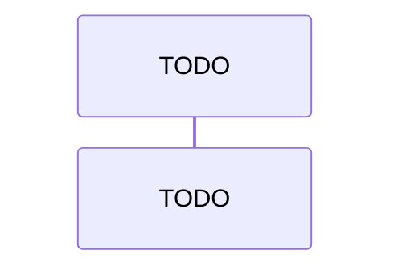

# Интерфейсы взаимодействия прототипа

> **Статус: шаблон.** Разделы заполняются в UNLOCKER-207 по коду, влитому в `develop`. Документ описывает реализованное, а не запланированное. Расхождения с [видением](00-vision.md) собираются в последнем разделе.
>
> Пометка `TODO(UNLOCKER-207)` означает: что заполнить и откуда брать. Перед вливанием пометки удаляются.

## 1. Карта интерфейсов

<!-- TODO(UNLOCKER-207): все точки взаимодействия, внешние и внутренние. Указать, какие из них публикует reverse proxy демо-стенда (только /mcp и webhook), а какие доступны только во внутренней сети compose. Добавить схему (mermaid flowchart). -->

| Интерфейс | Тип | Кто вызывает | Кто обслуживает | Доступность | Аутентификация |
|---|---|---|---|---|---|
| MCP `/mcp` | Streamable HTTP, JSON-RPC | AI-агент | `access/mcp-server` | | |
| Webhook адаптеров | HTTP POST | мастер-система (заглушка) | `adapters/*` | | |
| Admin REST | HTTP | оператор | ingestion-сервис | | |

## 2. MCP-сервер

### 2.1. Транспорт и протокол

<!-- TODO(UNLOCKER-207): endpoint, версия MCP-Protocol-Version, когда ответ приходит как JSON, а когда как text/event-stream; stateless; заголовки. Источник — конфигурация access/mcp-server. -->

### 2.2. Аутентификация и scopes

<!-- TODO(UNLOCKER-207): issuer/audience, Protected Resource Metadata, таблица tool → scope, поведение при 401 и 403. Источник — конфигурация Spring Security в mcp-server. -->

| Tool | Scope |
|---|---|
| | |

### 2.3. Общие правила ответа

<!-- TODO(UNLOCKER-207): лимиты (maxDepth, maxNodes, maxPaths, timeout, maxResponseBytes) и их значения; truncated=true; provenance, lastSeenAt и stale-флаг; conflict markers; формат ошибок tool. Источник — access/graph-query-core. -->

| Лимит | Значение | Где задаётся |
|---|---|---|
| | | |

### 2.4. Tools

<!-- TODO(UNLOCKER-207): по подразделу на каждый tool из реального tools/list. Ожидаемый состав PoC: search_assets, get_asset, find_runtime_footprint, trace_dependencies (включая mode=impact), explain_provenance. Сверить с выводом tools/list запущенного сервера и приложить этот вывод к PR. -->

#### `<tool_name>`

- **Назначение:**
- **Scope:**
- **ID шаблона запроса:** <!-- из реестра graph-query-core -->
- **Параметры:**

| Параметр | Тип | Обязателен | Ограничения | Описание |
|---|---|---|---|---|
| | | | | |

- **Ответ:** <!-- структура и поля -->
- **Пример вызова и ответа:**

```text
// TODO(UNLOCKER-207): реальный запрос tools/call и ответ сервера
```

## 3. Webhook-эндпоинты адаптеров

<!-- TODO(UNLOCKER-207): по источнику (EAM, SCM, CMDB, deploy map): путь, формат тела, проверка подписи, timestamp и replay window, когда отдаётся 202, последующий GET by id к источнику, коды ошибок. Источник — adapters/*. -->

| Источник | Путь | Подпись | Тело (ключевые поля) | Ответы |
|---|---|---|---|---|
| | | | | |

## 4. Admin REST ingestion-сервиса

<!-- TODO(UNLOCKER-207): операции reconcile, replay, rebuild, загрузка crosswalk. Для каждой указать метод, путь, параметры, scope (architecture.admin), синхронная она или асинхронная, что пишется в аудит. Отметить, что эндпоинт не публикуется reverse proxy. Источник — UNLOCKER-170. -->

| Операция | Метод и путь | Параметры | Результат | Аудит |
|---|---|---|---|---|
| | | | | |

## 5. Внутренние контракты

### 5.1. `SourceConnector` (source-spi)

<!-- TODO(UNLOCKER-207): сигнатуры fetchChanges(cursor, limit) и fetchById; типы SourcePage, SourceSnapshot, SourceCursor; ожидания к реализациям (пагинация, ошибки, rate limit). Источник — contracts/source-spi. -->

### 5.2. `CanonicalMapper`

<!-- TODO(UNLOCKER-207): контракт map(SourceEnvelope) → List<GraphCommand>; обработка неизвестной schema version и неполной записи. Источник — ingestion/normalizer. -->

### 5.3. `EventJournal` и `CanonicalEventPublisher`

<!-- TODO(UNLOCKER-207): методы, гарантии (at-least-once, дедупликация), граница для будущей замены на Kafka. Источник — UNLOCKER-164. -->

### 5.4. Каноническое событие (CloudEvent)

<!-- TODO(UNLOCKER-207): реальная схема architecture.asset.upserted.v1 и других типов из contracts/event-schemas: обязательные атрибуты, data, правила версионирования. Пример — реальный, из теста. -->

```text
// TODO(UNLOCKER-207): пример события из теста
```

### 5.5. Заглушки мастер-систем

<!-- TODO(UNLOCKER-207): REST-контракт заглушек EAM, SCM, CMDB и deploy map, а также управляемые сценарии (пропуск, out-of-order, 429/5xx). Формат deploy map пометить как временный: реальный формат предоставит владелец. -->

## 6. Безопасность на границах

<!-- TODO(UNLOCKER-207): OIDC (issuer, audience, проверка JWT), scopes, какие порты и пути публикуются в compose и reverse proxy, а какие остаются во внутренней сети. Источники — конфигурация Spring Security в access/mcp-server и ingestion-сервисе, platform/docker (compose, proxy). Проверить, что ни один интерфейс из разделов 2–4 не пропущен. Секреты и реальные адреса не указывать. -->

| Интерфейс | Аутентификация | Scope | Опубликован через proxy | Порт и путь в compose |
|---|---|---|---|---|
| MCP `/mcp` | | | | |
| Webhook адаптеров | | не применяется (подпись и timestamp) | | |
| Admin REST | | `architecture.admin` | нет (только внутренняя сеть) | |

## 7. Последовательности вызовов

<!-- TODO(UNLOCKER-207): по реальному коду, с именами компонентов и модулей. -->

### 7.1. Webhook → граф



### 7.2. Агент → MCP → Neo4j


## 8. Расхождения с видением

<!-- TODO(UNLOCKER-207): всё, что в коде сделано иначе, чем в 00-vision.md (состав tools, параметры, транспорт, эндпоинты). Для каждого пункта указать причину и ссылку на ADR или задачу. -->

| Тема | В видении | В коде | Причина / ADR |
|---|---|---|---|
| | | | |
